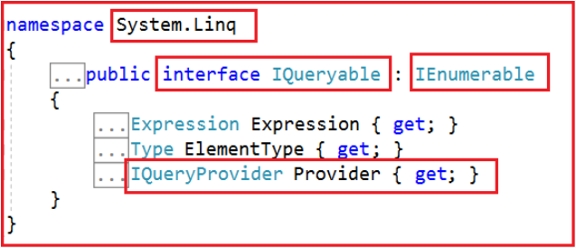
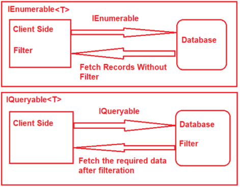
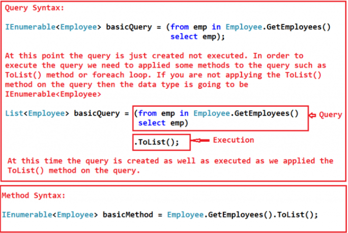
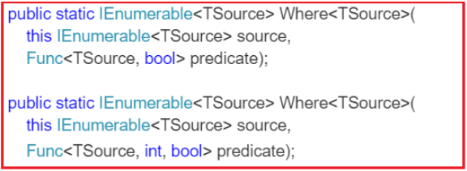
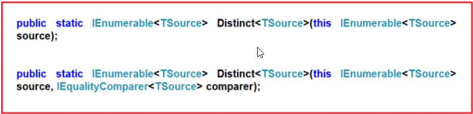
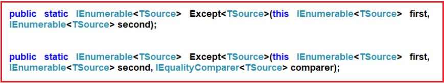
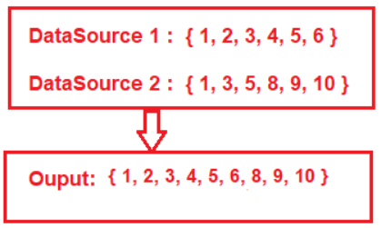

.. include:: include.rst

.. _Linq:

####
LINQ
####

LINQ stands for **Language-Integrated Query** and it is a powerful query language that was introduced with .Net 3.5 & Visual Studio 2008.

LINQ provides us common query syntax which allows us to query the data from various data sources.

That means using a single query we can get or set the data from various data sources such as SQL Server database, XML documents, ADO.NET Datasets, and any other in-memory objects such as Collections, Generics, etc.

//Add image (Linq_DataSources.png)

**************
Why Use Linq ?
**************

LINQ provides a uniform programming model (i.e. common query syntax) which allows us to work with different data sources but *using a standard or unified coding style*.
As a result, we don’t require to learn different syntaxes to query different data sources.

****************
How Linq Works ?
****************

//Add image for Linq_Architecture

The LINQ provider is a software component that lies between the LINQ queries and the actual data source. 
The Linq provider will convert the LINQ queries into a format that can be understood by the underlying data source. 
For example, LINQ to SQL provider will convert the LINQ queries to SQL statements which can be understood by the SQL Server database. 

**What are LINQ Providers?**

A LINQ provider is software that implements the **IQueryProvider** and **IQueryable** interface for a particular data source.
In other words, it allows us to write LINQ queries against that data source. If you want to create your custom LINQ provider then it must implement IQueryProvider and IQueryable interface.

**What is a Query?**

A query is nothing but a set of instructions which is applied on a data source (i.e. in-memory objects, SQL, XML, etc.) to perform certain operations (i.e. CRUD operations) and then tells the shape of the output from that query. 

Each query is a combination of three things.

* Initialization (to work with a particular data source)

* Condition (where, filter, sorting condition)

* Selection (single selection, group selection or joining)

We can write the LINQ query in three different ways. They are as follows

* Query Syntax

* Method Syntax

* Mixed Syntax (Query + Method)

**LINQ Query Syntax:**

This is one of the easy ways to write complex LINQ queries in an easy and readable format. The syntax for this type of query is very much similar to SQL Query.

//Add image of linq query syntax

**LINQ Method Syntax:**

It uses a lambda expression to define the condition for the query. Method syntaxes are easy to write simple queries to perform read-write operations on a particular data source.
But for complex queries Method syntaxes are a little hard to write as compared to query syntax.

//Add image of  linqMethodquery

**LINQ Mixed Syntax:**

This is the combination of both Query and Method syntax.

//Add image of LinqMixedSyntax

.. code-block:: c#
   :caption: Linq Syntax example

        //-----------Data Source--------------
        List<int> integerList = new List<int>()
        {
            1, 2, 3, 4, 5, 6, 7, 8, 9, 10
        };

        //------------Query-----------------------
        //LINQ Query using Query Syntax
        var QuerySyntax = from obj in integerList
                            where obj > 5
                            select obj;

        //LINQ Query using Method Syntax
        var MethodSyntax = integerList.Where(obj => obj > 5).ToList();

        //LINQ Query using Mixed Syntax
        var Mixedyntax = (from obj in integerList
                                where obj > 5
                                select obj).Sum();
        
        //--------------Execution---------------------        
        foreach(var item in ____Syntax)
        {
            Console.Write(item + " ");
        }

**************************
IEnumerable and IQueryable
**************************

**IEnumerable** is an interface that is available in System.Collection namespace. The IEnumerable interface is a type of *iteration design pattern*. It means we can iterate on the collection of the type IEnumerable.
As you can see in the above definition, the IEnumerable interface has one method called *GetEnumerator* which will return an IEnumerator that iterates through a collection.

Note : All the collection classes (both generic and non-generic) implements the IEnumerable interface. 
The IEnumerable or IEnumerable<T> interface should be used only for in-memory data objects.

//Linq Query to Fetch all students with Gender Male
IEnumerable<Student> QuerySyntax = from std in studentList
                                    where std.Gender == "Male"
                                    select std;
    
IEnumerable is mostly used for LINQ to Object and LINQ to XML queries.

**IQueryable** is an interface and it is available in System.Linq namespace.

The IQuerable interface is a *child of the IEnumerable interface*. So we can store IQuerable in a variable of type IEnumerable.
The IQuerable interface has a property called Provider which is of type IQueryProvider interface.

The methods provided by the IQueryProvider are used to create all Linq Providers.
So, this is the best choice for other data providers such as *Linq to SQL, Linq to Entities*, etc. 

//Linq Query to Fetch all students with Gender Male
IQueryable<Student> MethodSyntax = studentList.AsQueryable()
                    .Where(std => std.Gender == "Male");

IQueryable is mostly used for LINQ to SQL and LINQ to Entities queries.

**Difference between IEnumerable and IQuerable**

The IEnumerable and IQueryable are used to hold a collection of data and also used to perform data manipulation operations such as filtering, Ordering, Grouping, etc. based on the business requirements. 

                                              

The LINQ’s standard query operators such as **select**, **where**, etc. are implemented in Enumerable class. These methods are implemented as **extension** methods of the type IEnumerable<T> interface.

**LINQ Operators**

The LINQ Operators are nothing but a set of extension methods that are used to write LINQ Query. These LINQ extension methods provide lots of very useful features which we can apply to the data source.
Some of the features are filtering the data, sorting the data, grouping the data, etc.

*******************************
LINQ Select Projection Operator
*******************************

**What is Projection?**

Projection is nothing but the mechanism which is used to select the data from a data source. You can select the data in the same form (i.e. the original data in its original state).
It is also possible to create a new form of data by performing some operations on it.

There are two methods available in projection. 

* Select

LINQ **Select operator** also allows us to specify what properties we want to retrieve, whether you want to retrieve all the properties or some of the properties that you need to specify in the select operator.
The standard LINQ Select Operator also allows us to perform some calculations.

**How to select single property**

//Using Query Syntax
List<int> basicPropQuery = (from emp in Employee.GetEmployees()
                                        select emp.ID)
                                        .ToList();

//Using Method Syntax
IEnumerable<int> basicPropMethod = Employee.GetEmployees()
                                    .Select(emp => emp.ID);

**How to select specific properties in class**

//Query Syntax
IEnumerable<Employee> selectQuery = (from emp in Employee.GetEmployees()
                                        select new Employee()
                                        {
                                            FirstName = emp.FirstName,
                                            LastName = emp.LastName,
                                            Salary = emp.Salary
                                        });

//Method Syntax
List<Employee> selectMethod = Employee.GetEmployees().
                                Select(emp => new Employee()
                                {
                                    FirstName = emp.FirstName,
                                    LastName = emp.LastName,
                                    Salary = emp.Salary
                                }).ToList();

**How to Select Data to Anonymous Type**

//Query Syntax
var selectQuery = (from emp in Employee.GetEmployees()
                                        select new
                                        {
                                            FirstName = emp.FirstName,
                                            LastName = emp.LastName,
                                            Salary = emp.Salary
                                        });

**How to perform calculations on data selected**

 var selectMethod = Employee.GetEmployees().
                                          Select(emp => new
                                          {
                                              EmployeeId = emp.ID,
                                              FullName = emp.FirstName + " " + emp.LastName,
                                              AnnualSalary = emp.Salary * 12
                                          }).ToList();
foreach (var emp in selectMethod)
{
    Console.WriteLine($" ID {emp.EmployeeId} Name : {emp.FullName} Annual Salary : {emp.AnnualSalary} ");
}

**How to select data with index value**

var selectMethod = Employee.GetEmployees().
                                          Select((emp, index) => new
                                          {
                                              IndexPosition = index,
                                              FullName = emp.FirstName + " " + emp.LastName,
                                              Salary = emp.Salary
                                          });

var query = (from emp in Employee.GetEmployees().Select((value, index) => new { value, index })
                         select new
                         {
                             IndexPosition = emp.index,
                             FullName = emp.value.FirstName + " " + emp.value.LastName,
                             Salary = emp.value.Salary
                         }).ToList();

* SelectMany

SelectMany operator combines the records from a sequence of results and then converts it into one result. 

SelectMany method returns an IEnumerable<char>. This is because the SelectMany method returns all the elements from the sequence. Here the List is the sequence. And the list contains the strings.
Here the list contains two strings. So, the SelectMany method fetches all the characters from the above two strings and then converts it into one sequence i.e. IEnumerable<char>.

List<string> nameList =new List<string>(){"Manoj", "Prabhakar" };

IEnumerable<char> methodSyntax = nameList.SelectMany(x => x);

IEnumerable<char> querySyntax = from str in nameList
                                            from ch in str
                                            select ch;

foreach(char c in _____Syntax)
{
    Console.Write(c + " ");
}

**LINQ SelectMany with Complex Type**

public static List<Student> GetStudents()
{
    return new List<Student>()
    {
        new Student(){ID = 1, Name = "James", Email = "James@j.com", Programming = new List<string>() { "C#", "Jave", "C++"} },
        new Student(){ID = 2, Name = "Sam", Email = "Sara@j.com", Programming = new List<string>() { "WCF", "SQL Server", "C#" }},
        new Student(){ID = 3, Name = "Patrik", Email = "Patrik@j.com", Programming = new List<string>() { "MVC", "Jave", "LINQ"} },
        new Student(){ID = 4, Name = "Sara", Email = "Sara@j.com", Programming = new List<string>() { "ADO.NET", "C#", "LINQ" } }
    };
}

 //Using Method Syntax
List<string> MethodSyntax = Student.GetStudents().SelectMany(std => std.Programming).ToList();

//Using Query Syntax
IEnumerable<string> QuerySyntax = from std in Student.GetStudents()
                    from program in std.Programming
                    select program;

//To Avoid Duplication
List<string> MethodSyntax = Student.GetStudents()
                            .SelectMany(std => std.Programming)
                            .Distinct()
                            .ToList();

//fetch student name along with programming Language
var MethodSyntax = Student.GetStudents()
                                    .SelectMany(std => std.Programming,
                                            (student, program) => new
                                            {
                                                StudentName = student.Name,
                                                ProgramName = program
                                            }
                                            )
                                    .ToList();

var QuerySyntax = (from std in Student.GetStudents()
                               from program in std.Programming
                               select new {
                                   StudentName = std.Name,
                                   ProgramName = program
                               }).ToList();
                               

//Printing the values
foreach (string program in MethodSyntax)
{
    Console.WriteLine(program);
}

*************************
Where Filtering Operators
*************************

**Filtering** is nothing but the process to get only those elements from a data source that satisfied the given condition.
It is also possible to fetch the data from a data source with more than one condition as per our business requirement.

* Where

The “where” always expects at least one condition and we can specify the condition(s) using predicates. The conditions can be written using the following symbols

==, >=, <=, &&, ||, >, <, etc.

A predicate is nothing but a function that is used to test each and every element for a given condition.

List<int> intList = new List<int> { 1, 2, 3, 4, 5, 6, 7, 8, 9, 10 };

//-----------------Where usage for Overload 1-----------------------
//Method Syntax
IEnumerable<int> filteredData = intList.Where(num => num > 5);

//Query Syntax
IEnumerable<int> filteredResult = from num in intList
                                    where num > 5
                                    select num;

//-----------------Where usage for Overload 2-----------------------

 //Method Syntax
var OddNumbersWithIndexPosition = intList.Select((num, index) => new
                                    {
                                        Numbers = num,
                                        IndexPosition = index
                                    }).Where(x => x.Numbers % 2 != 0)
                                    .Select(data => new
                                    {
                                        Number = data.Numbers,
                                        IndexPosition = data.IndexPosition
                                    });

//Query Syntax
var OddNumbersWithIndexPosition = from number in intList.Select((num, index) => new {Numbers = num, IndexPosition = index })
                                    where number.Numbers % 2 != 0
                                    select new
                                    {
                                        Number = number.Numbers,
                                        IndexPosition = number.IndexPosition
                                    };

//-------------------------Where usage for Complex types----------------------------

//Query Syntax
var QuerySyntax = from employee in Employee.GetEmployees()
                    where employee.Salary > 50000
                    select employee;

//Method Syntax
var MethodSyntax = Employee.GetEmployees()
                    .Where(emp => emp.Salary > 50000);

//----------------Multiple Condition----------------------

//Query Syntax
var QuerySyntax = from employee in Employee.GetEmployees()
                    where employee.Salary > 500000 && employee.Gender == "Male"
                    select employee;

//Method Syntax
var MethodSyntax = Employee.GetEmployees()
                    .Where(emp => emp.Salary > 500000 && emp.Gender == "Male")
                    .ToList();

//----------Multiple conditions with the custom operation and projecting the data to an anonymous type---------

 //Query Syntax
var QuerySyntax = (from employee in Employee.GetEmployees()
                    where employee.Salary >= 50000 && employee.Technology != null
                    select new {
                        EmployeeName = employee.Name,
                        Gender = employee.Gender,
                        MonthlySalary = employee.Salary / 12
                    }).ToList();
            
//Method Syntax
var MethodSyntax = Employee.GetEmployees()
                    .Where(emp => emp.Salary >= 50000 && emp.Technology != null)
                    .Select(emp => new {
                        EmployeeName = emp.Name,
                        Gender = emp.Gender,
                        MonthlySalary = emp.Salary / 12
                    })
                    .ToList();

* OfType

The **OfType** Operator in LINQ is used to filter specific type data from a data source based on the data type we passed to this operator.
For example, if we have a collection that stores both integer and string values and if we need to fetch either only the integer values or
only the string values from that collection then we need to use the OfType operator.

public static IEnumerable<TResult> OfType<TResult>(this IEnumerable source);

List<object> dataSource = new List<object>()
{
    "Tom", "Mary", 50, "Prince", "Jack", 10, 20, 30, 40, "James"
};

List<int> intData = dataSource.OfType<int>().ToList();

//Query Syntax
var stringData = (from name in dataSource
                           where name is string
                           select name).ToList();

//OfType and is Operator with a condition

var intData = dataSource.OfType<int>().Where(num => num > 30).ToList();

var stringData = (from name in dataSource
                           where name is string && name.ToString().Length > 3
                           select name).ToList();

************
Set Operator
************

The **Set** Operators in LINQ are used to produce the result set based on the presence and absence of elements within the same or different data sources.

That means these operations are performed either on a single data source or on multiple data sources and in the output some of the data are present and some of the data are absent.

**When to Use**

* If we need to select the distinct records from a data source (No Duplicate Records) then we need to use Set Operators.

* Suppose we need to select all the Employees of a company except a particular department then you need to use Set Operations.

* Another example maybe if you have multiple classes and you want only to select all the toppers from all the classes then also you need to use Set Operations.

* Suppose we have different data sources with similar structure and if we want to combine all the data sources into a single data source then we need to use Set Operations.

**Distinct**

We need to use the Distinct() method when we want to remove the duplicate data or records from a data source. This method operates on a single data source.

.. code-block:: c#
   :caption: Distinct example

        List<int> intCollection = new List<int>()
                    {
                        1,2,3,2,3,4,4,5,6,3,4,5
                    };

        //Using Method Syntax
        var MS = intCollection.Distinct();

        //Using Query Syntax
        var QS = (from num in intCollection
                    select num).Distinct();

        //Get Distinct names by ignoring case
        string[] namesArray = { "Priyanka", "HINA", "hina", "Anurag", "Anurag", "ABC", "abc" };

        //StringComparer class implements the IEqualityComparer interface 
        var distinctNames = namesArray.Distinct(StringComparer.OrdinalIgnoreCase);

        //----------Dinstinct for complex type------------------

        //Using Method Syntax
        var MS = Student.GetStudents()
                .Select(std => std.Name)
                .Distinct().ToList();

        //Using Query Syntax
        var QS = (from std in Student.GetStudents()
                    select std.Name)
                    .Distinct().ToList();

        //----------Implementing IEqualityComparer interface---------------
        //----------To compare the student object to avoid duplicate-------
        public class StudentComparer : IEqualityComparer<Student>
        {
            public bool Equals(Student x, Student y)
            {
                //First check if both object reference are equal then return true
                if(object.ReferenceEquals(x, y))
                {
                    return true;
                }
                //If either one of the object refernce is null, return false
                if (object.ReferenceEquals(x,null) || object.ReferenceEquals(y, null))
                {
                    return false;
                }
                //Comparing all the properties one by one
                return x.ID == y.ID && x.Name == y.Name;
            }
            public int GetHashCode(Student obj)
            {
                //If obj is null then return 0
                if (obj == null)
                {
                    return 0;
                }
                //Get the ID hash code value
                int IDHashCode = obj.ID.GetHashCode();
                //Get the string HashCode Value
                //Check for null refernece exception
                int NameHashCode = obj.Name == null ? 0 : obj.Name.GetHashCode();
                return IDHashCode ^ NameHashCode;
            }
        }

        //Creating an instance of StudentComparer
        StudentComparer studentComparer = new StudentComparer();

        //Using Method Syntax
        var MS = Student.GetStudents()
                .Distinct(studentComparer).ToList();
        //Using Query Syntax
        var QS = (from std in Student.GetStudents()
                    select std)
                    .Distinct(studentComparer).ToList();

        //------Overriding the Equals() and GetHashCode() methods in Student Class--------
        public override bool Equals(object obj)
        {
            //As the obj parameter type id object, so we need to
            //cast it to Student Type
            return this.ID == ((Student)obj).ID && this.Name == ((Student)obj).Name;
        }
        public override int GetHashCode()
        {
            //Get the ID hash code value
            int IDHashCode = this.ID.GetHashCode();
            //Get the string HashCode Value
            //Check for null refernece exception
            int NameHashCode = this.Name == null ? 0 : this.Name.GetHashCode();
            return IDHashCode ^ NameHashCode;
        }

        /Using Method Syntax
            var MS = Student.GetStudents()
                    .Distinct().ToList();
        //Using Query Syntax
        var QS = (from std in Student.GetStudents()
                    select std)
                    .Distinct().ToList();

**Except**

Except() LINQ Extension method return all the elements from the first data source which do not exists in the second data source.
This method operates on two data sources.

.. code-block:: c#
   :caption: Except example
        List<int> dataSource1 = new List<int>() { 1, 2, 3, 4, 5, 6 };
        List<int> dataSource2 = new List<int>() { 1, 3, 5, 8, 9, 10 };
        //Method Syntax
        var MS = dataSource1.Except(dataSource2).ToList();
        //Query Syntax
        var QS = (from num in dataSource1
                    select num)
                    .Except(dataSource2).ToList();

Reference : `Linq Except blog <https://dotnettutorials.net/lesson/linq-except-method/>`_

**Intersect**

This method is used to return the common elements from both the data sources i.e. the elements which exist in both the data set are going to returns as output.

.. code-block:: c#
   :caption: Intersect example
        List<int> dataSource1 = new List<int>() { 1, 2, 3, 4, 5, 6 };
        List<int> dataSource2 = new List<int>() { 1, 3, 5, 8, 9, 10 };
        //Method Syntax
        var MS = dataSource1.Intersect(dataSource2).ToList();
        //Query Syntax
        var QS = (from num in dataSource1
                    select num)
                    .Intersect(dataSource2).ToList();

Reference : `Linq Intersect blog <https://dotnettutorials.net/lesson/linq-intersect-method/>`_

**Union**

This method is used to return all the elements which are present in either of the data sources.
That means it combines the data from both the data sources and produce a single result set.

.. code-block:: c#
   :caption: Union example
        List<int> dataSource1 = new List<int>() { 1, 2, 3, 4, 5, 6 };
        List<int> dataSource2 = new List<int>() { 1, 3, 5, 8, 9, 10 };
        //Method Syntax
        var MS = dataSource1.Union(dataSource2).ToList();
        //Query Syntax
        var QS = (from num in dataSource1
                    select num)
                    .Union(dataSource2).ToList();

**Concat Method**

The Linq Concat Method in C# is used to concatenate two sequences into one sequence.

.. code-block:: c#
   :caption: Concat example
        List<int> sequence1 = new List<int> { 1, 2, 3, 4 };
        List<int> sequence2 = new List<int> { 2, 4, 6, 8 };
        var result = sequence1.Concat(sequence2);

        //output
        //1, 2, 3, 4, 2, 4, 6, 8

// Concat will not remove duplicate items. Need to use Union if neede to remove duplicate items.

*****************
Ordering Operator
*****************

Ordering is a process to manage the data in a particular order.

It is not changing the data or output rather this operation arranges the data in a particular order i.e. either ascending order or descending order.

There are five methods provided by LINQ to sort the data. 

* OrderBy

The Linq OrderBy method in C# is used to sort the data in ascending order.

.. code-block:: c#
   :caption: OrderBy example
        List<int> intList = new List<int>() { 10, 45, 35, 29, 100, 69, 58, 50 };

        //Sorting the data in Ascending Order
        //Using Method Syntax
        var MS = intList.OrderBy(num => num);
        //Using Query Syntax
        var QS = (from num in intList
                    orderby num
                    select num).ToList();

        //------Complex Type---------------
        var MS = Student.GetAllStudents().OrderBy(x => x.Branch).ToList();

        //------Orderby with Filtering-----
        var MS = Student.GetAllStudents()
                            .Where(std => std.Branch.ToUpper() == "CSE")
                            .OrderBy(x => x.FirstName).ToList();

* OrderByDescending

The LINQ OrderByDescending method in C# is used to sort the data in descending order.

.. code-block:: c#
   :caption: OrderByDescending example
        List<int> intList = new List<int>() { 10, 45, 35, 29, 100, 69, 58, 50 };

        var MS = intList.OrderByDescending(num => num);

        //Complex type
        var MS = Student.GetAllStudents().OrderByDescending(x => x.Branch).ToList();

        //Query Syntax
            var QS = (from std in Student.GetAllStudents()
                      orderby std.Branch descending
                      select std);

* ThenBy and ThenByDescending

The LINQ OrderBy or OrderByDescending method works fine when you want to sort the data based on a single value or a single expression.

But if you want to sort the data based on multiple values or multiple expressions then you need to use the LINQ ThenBy and ThenByDescending Method along with OrderBy or OrderByDescending Method.

The OrderBy or OrderByDescending method is generally used for primary sorting. ThenBy or ThenByDescending are used for secondary sorting and so on

.. code-block:: c#
   :caption: ThenBy and ThenByDescending example
        var MS = Student.GetAllStudents()
                              .OrderBy(x => x.FirstName)
                              .ThenBy(y => y.LastName)
                              .ToList();

        var QS = (from std in Student.GetAllStudents()
                      orderby std.FirstName, std.LastName
                      select std);

        //First sort the data in ascending order based on Branch. Then sort the data in descending order based on First Name. 
        //Finally, sort the data on the ascending order based on the Last Name values.
        var MS = Student.GetAllStudents()
                     .OrderBy(x => x.Branch)
                     .ThenByDescending(y => y.FirstName)
                     .ThenBy(z => z.LastName)
                     .ToList();
        //Query Syntax
        var QS = (from std in Student.GetAllStudents()
                    orderby std.Branch ascending, 
                            std.FirstName descending, 
                            std.LastName
                    select std).ToList();

        //first we need to fetch only the CSE branch students and then we need to sort the data as follows. First sort the data in ascending order based on First Name.
        //Then sort the data in descending order based on the Last Name.

        //Using Method Syntax
            var MS = Student.GetAllStudents()
                     .Where(std => std.Branch == "CSE")
                     .OrderBy(x => x.FirstName)
                     .ThenByDescending(y => y.LastName)
                     .ToList();
        //Query Syntax
        var QS = (from std in Student.GetAllStudents()
                    where std.Branch == "CSE"
                    orderby std.FirstName, 
                            std.LastName descending
                    select std).ToList();

* Reverse

The LINQ Reverse method is used to reverse the data stored in a data source. That means this method will not change the data rather it simple reverse the data stored in the data source.
So, as a result, we will get the output in reverse order.

.. code-block:: c#
   :caption: Reverse example

        int[] intArray = new int[] { 10, 30, 50, 40,60,20,70,100 };

        IEnumerable<int> ArrayReversedData = intArray.Reverse();

        IEnumerable<int> ArrayReversedData = (from num in intArray
                                                  select num).Reverse();

        List<string> stringList = new List<string>() { "Preety", "Tiwary", "Agrawal", "Priyanka", "Dewangan"};

        //You cannot store the data like below as this method belongs to
        //System.Collections.Generic namespace whose return type is void
        //IEnumerable<int> ArrayReversedData = stringList.Reverse();

        stringList.Reverse();  //this will update the source list

        //apply the Linq Reverse method on a collection of List<T> type
        //convert to the List<T> collection to as IEnumerable or IQueryable collection by 
        //using the AsEnumerable() or AsQueryable() method on the data source.

        IEnumerable<string> ReverseData1 = stringList.AsEnumerable().Reverse();

        IQueryable<string> ReverseData2 = stringList.AsQueryable().Reverse();

