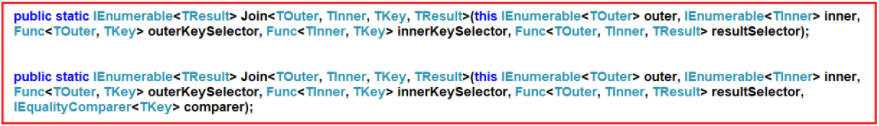
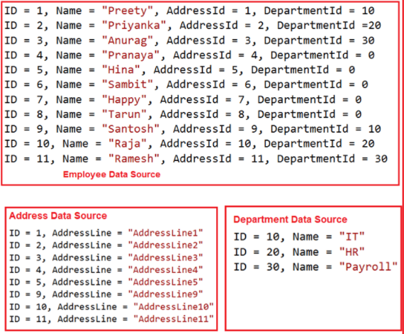

.. include:: include.rst

.. _LINQ_2:

****************
Aggregate Method
****************

The Linq aggregate functions are used to group together the values of multiple rows as the input and then return the output as a single value.
So, simple word, we can say that the aggregate function in C# is always going to return a single value. 

**When to use the Aggregate Functions in C#?**

Whenever you want to perform some mathematical operations such as Sum, Count, Max, Min, Average, and Aggregate on the numeric property of a collection
then you need to use the Linq Aggregate Functions.

**Sum**

.. code-block:: c#
   :caption: Sum example
        int[] intNumbers = new int[] { 10, 30, 50, 40, 60, 20, 70, 90, 80, 100 };
        //Using Method Syntax
        int MSTotal = intNumbers.Sum();
        //Using Query Syntax
        int QSTotal = (from num in intNumbers
                        select num).Sum();

        //With Filtering
        //Using Method Syntax
        int MSTotal = intNumbers.Where(num => num > 50).Sum();
        //Using Query Syntax
        int QSTotal = (from num in intNumbers
                        where num > 50
                        select num).Sum();

        //Using Method Syntax with a Predicate
        int MSTotal = intNumbers.Sum(num => {
            if (num > 50)
                return num;
            else
                return 0;
        });

        //---------Complex Types----------------
        //Using Method Syntax
        var TotalSalaryMS = Employee.GetAllEmployees()
                            .Sum(emp => emp.Salary);
        //Using Query Syntax
        var TotalSalaryQS = (from emp in Employee.GetAllEmployees()
                                select emp).Sum(e => e.Salary);
        

**Max**

The Linq Max in C# is used to returns the largest numeric value from the collection on which it is applied.

.. code-block:: c#
   :caption: Max example

        int[] intNumbers = new int[] { 10, 80, 50, 90, 60, 30, 70, 40, 20, 100 };
        //Using Method Syntax
        int MSLergestNumber = intNumbers.Max();
        //Using Query Syntax
        int QSLergestNumber = (from num in intNumbers
                        select num).Max();
        //With Filter,Predicate and complex type refer above 

**Min**

The Linq Min method is used to returns the lowest numeric value from the collection on which it is applied.

.. code-block:: c#
   :caption: Min example

        int[] intNumbers = new int[] { 60, 80, 50, 90, 10, 30, 70, 40, 20, 100 };
        //Using Method Syntax
        int MSLowestNumber = intNumbers.Min();
        //Using Query Syntax
        int QSLowestNumber = (from num in intNumbers
                        select num).Min();

**Average**

The Linq Average method is used to calculate the average of numeric values from the collection on which it is applied.
This Average method can return nullable or non-nullable decimal, float or double value.

.. code-block:: c#
   :caption: Average example
        int[] intNumbers = new int[] { 60, 80, 50, 90, 10, 30, 70, 40, 20, 100 };
        //Using Method Syntax
        var MSAverageValue = intNumbers.Average();
        //Using Query Syntax
        var QSAverageValue = (from num in intNumbers
                                select num).Average();

**Count**

The Linq Count Method used to return the number of elements present in the collection or the number of elements that have satisfied a given condition.

.. code-block:: c#
   :caption: Count example
        int[] intNumbers = new int[] { 60, 80, 50, 90, 10, 30, 70, 40, 20, 100 };
        //Using Method Syntax
        int MSCount = intNumbers.Count();
        //Using Query Syntax
        var QSCount = (from num in intNumbers
                                select num).Count();

**Aggregate**

The Linq Aggregate extension method performs an accumulative operation.
There are three overloaded versions of this method is available in System.Linq namespace.

.. image:: images/Linq_Aggregate_Overload.png
   :width: 400

.. code-block:: c#
   :caption: Aggregate example
      //Overload 1
      string[] skills = { "C#.NET", "MVC", "WCF", "SQL", "LINQ", "ASP.NET" };
      string result = skills.Aggregate((s1, s2) => s1 + ", " + s2);

      int[] intNumbers = { 3, 5, 7, 9 };
      int result = intNumbers.Aggregate((n1, n2) => n1 * n2);

      //Overload 2 - Aggregate method takes the first parameter as the seed value to accumulate.
      int[] intNumbers = { 3, 5, 7, 9 };
      int result = intNumbers.Aggregate(2, (n1, n2) => n1 * n2);

      //Complex type
      int Salary = Employee.GetAllEmployees()
                            .Aggregate<Employee, int>(0,
                            (TotalSalary, emp) => TotalSalary += emp.Salary);

      //Overload 3 - Aggregate with Result selector
      string CommaSeparatedEmployeeNames = Employee.GetAllEmployees().Aggregate<Employee, string, string>(
                                        "Employee Names : ",  // seed value
                                        (employeeNames, employee) => employeeNames = employeeNames + employee.Name + ",",
                                        employeeNames => employeeNames.Substring(0, employeeNames.Length - 1));

*******************
Quantifier Operator
*******************

LINQ Quantifier Operators on a data source when we want to check if some or all of the elements of that data source satisfy a condition or not.

All the methods in quantifier operations are always going to return a Boolean value. That means if the all or some of the elements in the data source satisfy the given condition then it is going to return true else it is going to return false.

The following three methods belong to the Quantifier Operations category.

**All:** This specifies whether all the elements of a data source satisfy a given condition or not.

.. code-block:: c#
   :caption: All example
      int[] IntArray = { 11, 22, 33, 44, 55 };
      var Result = IntArray.All(x => x > 10);

      //Using Method Syntax - pass predicate using All for filtering
      var MSResult = Student.GetAllStudnets()
                        .Where(std => std.Subjects.All(x => x.Marks > 80)).ToList();

**Any:** This specifies whether at least one of the elements of a data source satisfies the condition or not.

.. code-block:: c#
   :caption: Any example
      int[] IntArray = { 11, 22, 33, 44, 55 };
      //Using Method Syntax
      var ResultMS = IntArray.Any();
      //Using Query Syntax
      var ResultQS = (from num in IntArray
                        select num).Any();
      Console.WriteLine("Is there any element in the collection : " + ResultMS);

      int[] IntArray = { 11, 22, 33, 44, 55 };
      var Result = IntArray.Any(x => x > 10);

      //fetch all the student details whose mark on any subject is greater than 90
      var MSResult = Student.GetAllStudnets()
                            .Where(std => std.Subjects.Any(x => x.Marks > 90)).ToList();

**Contains:** This method is used to check whether the data source contains a specified element or not.

.. code-block:: c#
   :caption: Contains example
      int[] IntArray = { 11, 22, 33, 44, 55 };      
      var IsExistsMS = IntArray.Contains(33);

      List<string> namesList = new List<string>(){ "James", "Sachin", "Sourav", "Pam", "Sara" };
      //Using Method Syntax
      //This method belongs to System.Collections.Generic namespace
      var IsExistsMS1 = namesList.Contains("Anurag");
      //This method belongs to System.Linq namespace
      var IsExistsMS2 = namesList.AsEnumerable().Contains("Anurag");

Note: if you want to check the values rather than the reference then you need to create a class and need to implement the IEqualityComparere interface.
Then you need to use the overloaded version of the Contains method which takes IEqualityComparere as a parameter.

.. code-block:: c#
   :caption: Contains example
      public class StudentComparer : IEqualityComparer<Student>
      {
        public bool Equals(Student x, Student y)
        {
            //If both object refernces are equal then return true
            if(object.ReferenceEquals(x, y))
            {
                return true;
            }
            //If one of the object refernce is null then return false
            if (x is null || y is null)
            {
                return false;
            }
            return x.ID == y.ID && x.Name == y.Name && x.TotalMarks == y.TotalMarks;
        }
      }

      //Creating Student Comparer Instance
      StudentComparer studentComparer = new StudentComparer();
      //Using Method Syntax
      var IsExistsMS = students.Contains(new Student() { ID = 101, Name = "Priyanka", TotalMarks = 275 }, studentComparer);

****************
GroupBy Operator
****************

This method takes a flat sequence of elements and then organizes the elements into groups (i.e. IGrouping<TKey, TSource>) based on a given key.

.. code-block:: c#
   :caption: GroupBy example
      //Using Method Syntax
      var GroupByMS = Student.GetStudents().GroupBy(s => s.Barnch);
      //Using Query Syntax
      IEnumerable<IGrouping<string, Student>> GroupByQS = (from std in Student.GetStudents()
                        group std by std.Barnch);
      //It will iterate through each groups
      foreach(var group in GroupByMS)
      {
            Console.WriteLine(group.Key +" : " + group.Count());
            //Iterate through each student of a group
            foreach(var student in group)
            {
               Console.WriteLine("  Name :" + student.Name + ", Age: " + student.Age + ", Gender :" + student.Gender);
            }
      }

Note: Each group has a key and you can access the key-value by using the key property. Along the same line, you can use the count property to check how many elements are there in that group.

********************
GroupBy Multiple Key
********************

In real-time applications, we need to group the data based on multiple keys.

Note that when you are using multiple keys in Group By operator then the data returned is an anonymous type.

.. code-block:: c#
   :caption: GroupBy Multiple key example

      var GroupByMultipleKeysMS = Student.GetStudents()
                                        .GroupBy(x => new { x.Barnch, x.Gender })
                                        .OrderByDescending(g => g.Key.Barnch).ThenBy(g => g.Key.Gender)
                                        .Select(g => new
                                        {
                                            Branch = g.Key.Barnch,
                                            Gender = g.Key.Gender,
                                            Students = g.OrderBy(x => x.Name)
                                        });

      //It will iterate through each group
      foreach (var group in GroupByMultipleKeysQS)
      {
            Console.WriteLine($"Barnch : {group.Branch} Gender: {group.Gender} No of Students = {group.Students.Count()}");
            //It will iterate through each item of a group
            foreach (var student in group.Students)
            {
               Console.WriteLine($"  ID: {student.ID}, Name: {student.Name}, Age: {student.Age} ");
            }
            Console.WriteLine();
      }

**********************
Linq ToLookUp Operator
**********************

The Linq ToLookup Method in C# exactly does the same thing as the GroupBy Operator does in Linq.
The only difference between these two methods is the **GroupBy method** uses *deferred execution*
whereas the execution of the **ToLookup method** is *immediate*.

.. code-block:: c#
   :caption: ToLookup example

      var GroupByMS = Student.GetStudents().ToLookup(s => s.Barnch);

      var GroupByQS = (from std in Student.GetStudents()
                             select std).ToLookup(x => x.Barnch);

**Deferred Execution vs Immediate Execution**

**Deferred or Lazy Operators:**

These query operators are used for deferred execution. 
For example – select, SelectMany, where, Take, Skip, etc. are belongs to Deferred or Lazy Operators category.

.. code-block:: c#
   :caption: Deferred example
      // In the below statement the LINQ Query is only defined and not executed
      // If the query is executed here, then the result should not display Santosh
      IEnumerable<Employee> result = from emp in listEmployees
                                       where emp.Salary == 80000
                                       select emp;

      // The LINQ query is actually executed when we iterate thru using a for each loop            
      foreach (Employee emp in result)
      {
            Console.WriteLine($" {emp.ID} {emp.Name} {emp.Salary}");
      }

**Advantages of Deferred Execution:**

* It avoids unnecessary query execution which improves the performance of the application.

* The Query creation and the Query execution are decoupled which provide us the flexibility to create the query in several steps.

* A Linq deferred execution query is always re-evaluated when we re-enumerate. As a result, we always get the updated data.

**Immediate or Greedy Operators:**

These query operators are used for immediate execution.
For Example – count, average, min, max, First, Last, ToArray, ToList, etc. are belongs to the Immediate or Greedy Operators category.

.. code-block:: c#
   :caption: Immediate example
      // In the following statement, the LINQ Query is executed immediately as we are
      // Using the ToList() method which is a greedy operator which forces the query 
      // to be executed immediately
      IEnumerable<Employee> result = (from emp in listEmployees
                                       where emp.Salary == 80000
                                       select emp).ToList();

*******************
Linq Join Operation
*******************

Join operations are used to fetch the data from two or more data sources based on some common properties present in the data sources.

There are two methods available in Linq to perform Join Operations.

**Join:** This operator is used to join two data sources or collection based on common property and return the data as a single result set.

**GroupJoin:** This operator is also used to join two data sources or collections based on a common key or property but return the result as a group of sequences.

**Types of Join Operator**

**Inner Join**

Linq Inner join is used to return only the matching elements from both the data sources while the non-matching elements are removed from the result set.

*Note*: While performing the Linq inner join then there should exist a common element or property in both the data sources.

1. Outer data source

2. Inner data source

3. Outer Key selector (common key in the outer data source)

4. Inner Key selector (Common key in the inner data source)

5. Result selector (project the data into a result set)

.. code-block:: c#
   :caption: Join example
      var JoinUsingMS = Employee.GetAllEmployees() //Outer Data Source
                           .Join(
                           Address.GetAllAddresses(),  //Inner Data Source
                           employee => employee.AddressId, //Inner Key Selector
                           address => address.ID, //Outer Key selector
                           (employee, address) => new //Projecting the data into a result set
                           {
                               EmployeeName = employee.Name,
                               AddressLine = address.AddressLine
                           }).ToList();

**Join using Multiple Data Source**

.. code-block:: c#
   :caption: Join using Multiple Data Sources example
      var JoinMultipleDSUsingMS =
               //Employee data Source (i.e. Data Source 1)
               Employee.GetAllEmployees()
               //Joining with Address data Source (i.e. Data Source 2)
               .Join(
                     Address.GetAllAddresses(), //Inner Data Source 1
                     empLevel1 => empLevel1.AddressId, //Outer Key selector
                     addLevel1 => addLevel1.ID, //Inner Key selector
                     //Result set
                     (empLevel1, addLevel1) => new { empLevel1, addLevel1 }
                  )
               // Joinging with Department data Source (i.e. data Source 3)
               .Join(
                     Department.GetAllDepartments(), //Inner Data Source 2
                     //You cannot access the outer key selector directly
                     //You can only access with the result set created in previous step
                     //i.e. using empLevel1 and addLevel1
                     empLevel2 => empLevel2.empLevel1.ID, //Outer Key selector
                     addLevel1 => addLevel1.ID, //Inner Key selector
                     //Result set
                     (empLevel2, addLevel1) => new { empLevel2, addLevel1 }
               )
               //Creating the actual result set
               .Select(e => new
               {
                  ID = e.empLevel2.empLevel1.ID,
                  EmployeeName = e.empLevel2.empLevel1.Name,
                  AddressLine = e.empLevel2.addLevel1.AddressLine,
                  DepartmentName = e.addLevel1.Name
               }).ToList();

***************
Linq Group Join
***************

Linq Group Join is used to group the result sets based on a common key.

Group Join is basically used to produces hierarchical data structures. Each item from the first data source is paired with a set of correlated items from the second data source.

.. code-block:: c#
   :caption: Group Join example
      var GroupJoinMS = Department.GetAllDepartments().
                GroupJoin(
                    Employee.GetAllEmployees(),
                    dept => dept.ID,
                    emp => emp.DepartmentId,
                    (dept, emp) => new {dept, emp}
                );
            //Printing the Result set
            //Outer Foreach is for all department
            foreach(var item in GroupJoinMS)
            {
                Console.WriteLine("Department :" + item.dept.Name);
                //Inner Foreach loop for each employee of a department
                foreach(var employee in item.emp)
                {
                    Console.WriteLine("  EmployeeID : " + employee.ID + " , Name : " + employee.Name);
                }
            }

*********
Left Join
*********

Left Outer Join is going to return all the matching data from both the data sources as well as all the non-matching data from the left data source.
In such cases, for the non-matching data, it will take null values for the second data source.

In order to implement the Linq Left Join in C#, it’s mandatory to use the “INTO” keyword along with the “DefaultIfEmpty()” method.

.. code-block:: c#
   :caption: Left Join example
      var MSOuterJOIN = Employee.GetAllEmployees()
                              .GroupJoin(
                                    Address.GetAddress(),
                                    emp => emp.AddressId,
                                    add => add.ID,
                                    (emp, add) => new { emp, add }
                              )
                              .SelectMany(
                                    x => x.add.DefaultIfEmpty(), 
                                    (employee, address) => new{ employee, address }
                               );

         foreach (var item in MSOuterJOIN)
         {
               Console.WriteLine($"Name : {item.employee.emp.Name}, Address : {item.address?.AddressLine} ");
         }

**********
Cross Join
**********

When combining two data sources (or you can two collections) using Linq Cross Join, then each element in the first data source (i.e. first collection) will be mapped with each and every element in the second data source (i.e. second collection).

.. code-block:: c#
   :caption: Cross Join example
      //Cross Join using SelectMany Method
      var CrossJoinResult = Student.GetAllStudnets()
                  .SelectMany(sub => Subject.GetAllSubjects(),
                     (std, sub) => new
                     {
                        Name = std.Name,
                        SubjectName = sub.SubjectName
                     });
      //Cross Join using Join Method
      var CrossJoinResult2 = Student.GetAllStudnets()
                  .Join(Subject.GetAllSubjects(),
                        std => true,
                        sub => true,
                        (std, sub) => new
                        {
                           Name = std.Name,
                           SubjectName = sub.SubjectName
                        }
                     );

