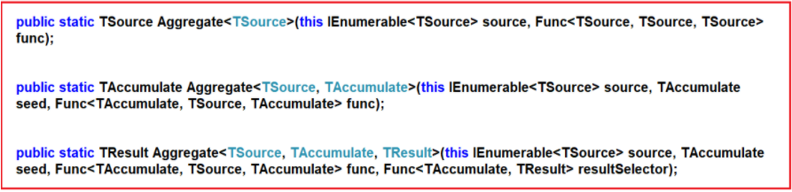

.. include:: include.rst

.. _LINQ_2:

****************
Aggregate Method
****************

The Linq aggregate functions are used to group together the values of multiple rows as the input and then return the output as a single value.
So, simple word, we can say that the aggregate function in C# is always going to return a single value. 

**When to use the Aggregate Functions in C#?**

Whenever you want to perform some mathematical operations such as Sum, Count, Max, Min, Average, and Aggregate on the numeric property of a collection
then you need to use the Linq Aggregate Functions.

**Sum**

.. code-block:: c#
   :caption: Sum example
        int[] intNumbers = new int[] { 10, 30, 50, 40, 60, 20, 70, 90, 80, 100 };
        //Using Method Syntax
        int MSTotal = intNumbers.Sum();
        //Using Query Syntax
        int QSTotal = (from num in intNumbers
                        select num).Sum();

        //With Filtering
        //Using Method Syntax
        int MSTotal = intNumbers.Where(num => num > 50).Sum();
        //Using Query Syntax
        int QSTotal = (from num in intNumbers
                        where num > 50
                        select num).Sum();

        //Using Method Syntax with a Predicate
        int MSTotal = intNumbers.Sum(num => {
            if (num > 50)
                return num;
            else
                return 0;
        });

        //---------Complex Types----------------
        //Using Method Syntax
        var TotalSalaryMS = Employee.GetAllEmployees()
                            .Sum(emp => emp.Salary);
        //Using Query Syntax
        var TotalSalaryQS = (from emp in Employee.GetAllEmployees()
                                select emp).Sum(e => e.Salary);
        

**Max**

The Linq Max in C# is used to returns the largest numeric value from the collection on which it is applied.

.. code-block:: c#
   :caption: Max example

        int[] intNumbers = new int[] { 10, 80, 50, 90, 60, 30, 70, 40, 20, 100 };
        //Using Method Syntax
        int MSLergestNumber = intNumbers.Max();
        //Using Query Syntax
        int QSLergestNumber = (from num in intNumbers
                        select num).Max();
        //With Filter,Predicate and complex type refer above 

**Min**

The Linq Min method is used to returns the lowest numeric value from the collection on which it is applied.

.. code-block:: c#
   :caption: Min example

        int[] intNumbers = new int[] { 60, 80, 50, 90, 10, 30, 70, 40, 20, 100 };
        //Using Method Syntax
        int MSLowestNumber = intNumbers.Min();
        //Using Query Syntax
        int QSLowestNumber = (from num in intNumbers
                        select num).Min();

**Average**

The Linq Average method is used to calculate the average of numeric values from the collection on which it is applied.
This Average method can return nullable or non-nullable decimal, float or double value.

.. code-block:: c#
   :caption: Average example
        int[] intNumbers = new int[] { 60, 80, 50, 90, 10, 30, 70, 40, 20, 100 };
        //Using Method Syntax
        var MSAverageValue = intNumbers.Average();
        //Using Query Syntax
        var QSAverageValue = (from num in intNumbers
                                select num).Average();

**Count**

The Linq Count Method used to return the number of elements present in the collection or the number of elements that have satisfied a given condition.

.. code-block:: c#
   :caption: Count example
        int[] intNumbers = new int[] { 60, 80, 50, 90, 10, 30, 70, 40, 20, 100 };
        //Using Method Syntax
        int MSCount = intNumbers.Count();
        //Using Query Syntax
        var QSCount = (from num in intNumbers
                                select num).Count();

**Aggregate**

The Linq Aggregate extension method performs an accumulative operation.
There are three overloaded versions of this method is available in System.Linq namespace.

