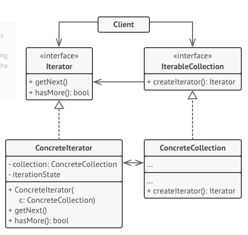

.. include:: include.rst

.. _behavioral_design_pattern:

###########################
Behavioral Pattern Concepts
###########################

**Behavioral patterns** are those patterns that are concerned with the interaction between the objects. 
The interaction between the objects should be in such a way that they are talking to each other and still are loosely coupled. 
The loose coupling is the key to **n-tier architecture**.

****************
Iterator Pattern
****************

**Iterator** is a behavioral design pattern that allows sequential traversal through a complex data structure without exposing its internal details.

* The **Iterator** defines an interface for accessing an Aggregate object and traversing elements within that Aggregate.

* The **ConcreteIterator** implements the Iterator interface and keeps track of its current position within the Aggregate.

* The **Aggregate** defines an interface for creating an Iterator object.

* The **ConcreteAggregate** implements the Iterator creation interface and returns a ConcreteIterator for that ConcreteAggregate.

.. code-block:: c#
    :caption: Iterator Pattern code example
        
        /// Our collection item.  Mostly because I'm a sucker for jelly beans.        
        class JellyBean
        {
            private string _flavor;

            // Constructor
            public JellyBean(string flavor)
            {
                this._flavor = flavor;
            }
                
            public string Flavor
            {
                get { return _flavor; }
            }
        }
        
        /// The aggregate interface       
        interface ICandyCollection
        {
            IJellyBeanIterator CreateIterator();
        }
       
        /// The ConcreteAggregate class       
        class JellyBeanCollection : ICandyCollection
        {
            private ArrayList _items = new ArrayList();

            public JellyBeanIterator CreateIterator()
            {
                return new JellyBeanIterator(this);
            }

            // Gets jelly bean count
            public int Count
            {
                get { return _items.Count; }
            }

            // Indexer
            public object this[int index]
            {
                get { return _items[index]; }
                set { _items.Add(value); }
            }
        }
       
        /// The 'Iterator' interface      
        interface IJellyBeanIterator
        {
            JellyBean First();
            JellyBean Next();
            bool IsDone { get; }
            JellyBean CurrentBean { get; }
        }
      
        /// The 'ConcreteIterator' class       
        class JellyBeanIterator : IJellyBeanIterator
        {
            private JellyBeanCollection _jellyBeans;
            private int _current = 0;
            private int _step = 1;

            // Constructor
            public JellyBeanIterator(JellyBeanCollection beans)
            {
                this._jellyBeans = beans;
            }

            // Gets first jelly bean
            public JellyBean First()
            {
                _current = 0;
                return _jellyBeans[_current] as JellyBean;
            }

            // Gets next jelly bean
            public JellyBean Next()
            {
                _current += _step;
                if (!IsDone)
                    return _jellyBeans[_current] as JellyBean;
                else
                    return null;
            }

            // Gets current iterator candy
            public JellyBean CurrentBean
            {
                get { return _jellyBeans[_current] as JellyBean; }
            }

            // Gets whether iteration is complete
            public bool IsDone
            {
                get { return _current >= _jellyBeans.Count; }
            }
        }

        static void Main(string[] args)
        {
            // Build a collection of jelly beans
            JellyBeanCollection collection = new JellyBeanCollection();
            collection[0] = new JellyBean("Cherry");
            collection[1] = new JellyBean("Bubble Gum");
            collection[2] = new JellyBean("Root Beer");
            collection[3] = new JellyBean("French Vanilla");
            
            // Create iterator
            JellyBeanIterator iterator = collection.CreateIterator();

            Console.WriteLine("Gimme all the jelly beans!");

            for (JellyBean item = iterator.First();
                !iterator.IsDone; item = iterator.Next())
            {
                Console.WriteLine(item.Flavor);
            }
        }

****************
Observer pattern
****************

**Observer pattern** allows one objects to notify other objects about changes in their state.

* **Subject** -> They are the publishers. When a change occurs to a subject it should notify all of its subscribers.

* **Observers** -> They are the subscribers. They simply listen to the changes in the subjects.

.. image:: images/ObserverPattern_1.png
   :width: 700

.. code-block:: c#
    :caption: Observer Pattern code example

        public interface IObserver
        {
            // Receive update from subject
            void Update(ISubject subject);
        }

        public interface ISubject
        {
            // Attach an observer to the subject.
            void Attach(IObserver observer);

            // Detach an observer from the subject.
            void Detach(IObserver observer);

            // Notify all observers about an event.
            void Notify();
        }

        // The Subject owns some important state and notifies observers when the
        // state changes.
        public class Subject : ISubject
        {
            // For the sake of simplicity, the Subject's state, essential to all
            // subscribers, is stored in this variable.
            public int State { get; set; } = -0;

            // List of subscribers. In real life, the list of subscribers can be
            // stored more comprehensively (categorized by event type, etc.).
            private List<IObserver> _observers = new List<IObserver>();

            // The subscription management methods.
            public void Attach(IObserver observer)
            {
                Console.WriteLine("Subject: Attached an observer.");
                this._observers.Add(observer);
            }

            public void Detach(IObserver observer)
            {
                this._observers.Remove(observer);
                Console.WriteLine("Subject: Detached an observer.");
            }

            // Trigger an update in each subscriber.
            public void Notify()
            {
                Console.WriteLine("Subject: Notifying observers...");

                foreach (var observer in _observers)
                {
                    observer.Update(this);
                }
            }

            // Usually, the subscription logic is only a fraction of what a Subject
            // can really do. Subjects commonly hold some important business logic,
            // that triggers a notification method whenever something important is
            // about to happen (or after it).
            public void SomeBusinessLogic()
            {
                Console.WriteLine("\nSubject: I'm doing something important.");
                this.State = new Random().Next(0, 10);

                Thread.Sleep(15);

                Console.WriteLine("Subject: My state has just changed to: " + this.State);
                this.Notify();
            }
        }

        // Concrete Observers react to the updates issued by the Subject they had
        // been attached to.
        class ConcreteObserverA : IObserver
        {
            public void Update(ISubject subject)
            {            
                if ((subject as Subject).State < 3)
                {
                    Console.WriteLine("ConcreteObserverA: Reacted to the event.");
                }
            }
        }

        class ConcreteObserverB : IObserver
        {
            public void Update(ISubject subject)
            {
                if ((subject as Subject).State == 0 || (subject as Subject).State >= 2)
                {
                    Console.WriteLine("ConcreteObserverB: Reacted to the event.");
                }
            }
        }
        
        class Program
        {
            static void Main(string[] args)
            {
                // The client code.
                var subject = new Subject();
                var observerA = new ConcreteObserverA();
                subject.Attach(observerA);

                var observerB = new ConcreteObserverB();
                subject.Attach(observerB);

                subject.SomeBusinessLogic();
                subject.SomeBusinessLogic();

                subject.Detach(observerB);

                subject.SomeBusinessLogic();
            }
        }

Reference : `Observer Pattern blog <https://www.exceptionnotfound.net/observer-pattern-in-csharp/>`_

*******************************
Chain Of Responsibility Pattern
*******************************

Avoid coupling the sender of a request to its receiver by giving more than one receiver object a chance to handle the request.

**Chain of responsibility** design pattern creates a chain of receiver objects for a given request.

Normally each receiver contains a reference to another receiver. If one receiver cannot handle the request then it passes the same request to the next receiver and so on.

.. image:: images/ChainOfResponsibility_Pattern_1.png
   :width: 700

.. image:: images/ChainOfResponsibility_Pattern_2.png
   :width: 700

.. code-block:: c#
    :caption: Chain of responsibility Pattern code example

        public abstract class Handler
        {
            public Handler rsHandler;
            public void nextHandler(Handler rsHandler)
            {
                this.rsHandler = rsHandler;
            }
            public abstract void dispatchRs(long requestedAmount);
        }

        public class TwoThousandHandler : Handler
        {
            public override void dispatchRs(long requestedAmount)
            {
                long numberofNotesToBeDispatched = requestedAmount / 2000;
                if (numberofNotesToBeDispatched > 0)
                {
                    if (numberofNotesToBeDispatched > 1)
                    {
                        Console.WriteLine(numberofNotesToBeDispatched + " Two Thousand notes are dispatched by TwoThousandHandler");
                    }                    
                }
                long pendingAmountToBeProcessed = requestedAmount % 2000;
                if (pendingAmountToBeProcessed > 0)
                {
                    rsHandler.dispatchRs(pendingAmountToBeProcessed);
                }
            }
        }

        public class FiveHundredHandler : Handler
        {
            public override void dispatchRs(long requestedAmount)
            {
                long numberofNotesToBeDispatched = requestedAmount / 500;
                if (numberofNotesToBeDispatched > 0)
                {
                    if (numberofNotesToBeDispatched > 1)
                    {
                        Console.WriteLine(numberofNotesToBeDispatched + " Five Hundred notes are dispatched by FiveHundredHandler");
                    }                    
                }
                long pendingAmountToBeProcessed = requestedAmount % 500;
                if (pendingAmountToBeProcessed > 0)
                {
                    rsHandler.dispatchRs(pendingAmountToBeProcessed);
                }
            }
        }

        public class ATM
        {
            private TwoThousandHandler twoThousandHandler = new TwoThousandHandler();
            private FiveHundredHandler fiveHundredHandler = new FiveHundredHandler();        
            
            public ATM()
            {
                // Prepare the chain of Handlers
                twoThousandHandler.nextHandler(fiveHundredHandler);
                
                //fiveHundredHandler.nextHandler(twoHundredHandler);               
            }
            public void withdraw(long requestedAmount)
            {
                twoThousandHandler.dispatchRs(requestedAmount);
            }
        }

        static void Main(string[] args)
        {
            ATM atm = new ATM();            
            atm.withdraw(4500);   // 2 * 2000 and 1 * 500
        }

*************
State Pattern
*************

**State Design Pattern** allows an object to alter its behavior when it’s internal state changes.

*Usage examples*: The State pattern is commonly used in C# to convert massive switch-base state machines into the objects.

The classes and objects participating in this pattern are:

**Context**

* defines the interface of interest to clients

* maintains an instance of a ConcreteState subclass that defines the current state.

**State**

* defines an interface for encapsulating the behavior associated with a particular state of the Context.

**Concrete States**

* each subclass implements a behavior associated with a state of Context

.. image:: images/StatePattern_1.png
   :width: 700

.. code-block:: c#
    :caption: State Pattern code example

        using System;

        namespace RefactoringGuru.DesignPatterns.State.Conceptual
        {
            // The Context defines the interface of interest to clients. It also
            // maintains a reference to an instance of a State subclass, which
            // represents the current state of the Context.
            class Context
            {
                // A reference to the current state of the Context.
                private State _state = null;

                public Context(State state)
                {
                    this.TransitionTo(state);
                }

                // The Context allows changing the State object at runtime.
                public void TransitionTo(State state)
                {
                    Console.WriteLine("Context: Transition to {state.GetType().Name}.");
                    this._state = state;
                    this._state.SetContext(this);
                }

                // The Context delegates part of its behavior to the current State
                // object.
                public void Request1()
                {
                    this._state.Handle1();
                }

                public void Request2()
                {
                    this._state.Handle2();
                }
            }
            
            // The base State class declares methods that all Concrete State should
            // implement and also provides a backreference to the Context object,
            // associated with the State. This backreference can be used by States to
            // transition the Context to another State.
            abstract class State
            {
                protected Context _context;

                public void SetContext(Context context)
                {
                    this._context = context;
                }

                public abstract void Handle1();

                public abstract void Handle2();
            }

            // Concrete States implement various behaviors, associated with a state of
            // the Context.
            class ConcreteStateA : State
            {
                public override void Handle1()
                {
                    Console.WriteLine("ConcreteStateA handles request1.");
                    Console.WriteLine("ConcreteStateA wants to change the state of the context.");
                    this._context.TransitionTo(new ConcreteStateB());
                }

                public override void Handle2()
                {
                    Console.WriteLine("ConcreteStateA handles request2.");
                }
            }

            class ConcreteStateB : State
            {
                public override void Handle1()
                {
                    Console.Write("ConcreteStateB handles request1.");
                }

                public override void Handle2()
                {
                    Console.WriteLine("ConcreteStateB handles request2.");
                    Console.WriteLine("ConcreteStateB wants to change the state of the context.");
                    this._context.TransitionTo(new ConcreteStateA());
                }
            }

            class Program
            {
                static void Main(string[] args)
                {
                    // The client code.
                    var context = new Context(new ConcreteStateA());
                    context.Request1();
                    context.Request2();
                }
            }
        }

****************
Template Pattern
****************

**Template Method Design Pattern** defines a sequence of steps of an algorithm and allows the subclasses to override the steps but not allowed to change the sequence.

The Key to this Pattern is that we put the general logic in the abstract parent class and let the child classes define the specifics.

* Used to get rid of the code duplication, leaving the algorithm structure intact

* Used to eliminate the conditionals in client code and use polymorphism when calling methods on a processing object.

.. code-block:: c#
    :caption: Template Pattern code example

        public abstract class HouseTemplate
        {
            // Template method defines the sequence for building a house
            public void BuildHouse()
            {
                BuildFoundation();
                BuildPillars();
                BuildWalls();
                BuildWindows();
                Console.WriteLine("House is built");
            }
            // Methods to be implemented by subclasses
            protected abstract void BuildFoundation();
            protected abstract void BuildPillars();
            protected abstract void BuildWalls();
            protected abstract void BuildWindows();
        }

        public class ConcreteHouse : HouseTemplate
        {
            protected override void BuildFoundation()
            {
                Console.WriteLine("Building foundation with cement, iron rods and sand");
            }
            protected override void BuildPillars()
            {
                Console.WriteLine("Building Concrete Pillars with Cement and Sand");
            }
            protected override void BuildWalls()
            {
                Console.WriteLine("Building Concrete Walls");
            }
            protected override void BuildWindows()
            {
                Console.WriteLine("Building Concrete Windows");
            }
        }

        public class WoodenHouse : HouseTemplate
        {
            protected override void BuildFoundation()
            {
                Console.WriteLine("Building foundation with cement, iron rods, wood and sand");
            }
            protected override void BuildPillars()
            {
                Console.WriteLine("Building wood Pillars with wood coating");
            }
            protected override void BuildWalls()
            {
                Console.WriteLine("Building Wood Walls");
            }
            protected override void BuildWindows()
            {
                Console.WriteLine("Building Wood Windows");
            }
        }
            
        static void Main(string[] args)
        {
            Console.WriteLine("Build a Concrete House\n");
            HouseTemplate houseTemplate = new ConcreteHouse();
            // call the template method
            houseTemplate.BuildHouse();
            Console.WriteLine();
            Console.WriteLine("Build a Wooden House\n");
            houseTemplate = new WoodenHouse();
            // call the template method
            houseTemplate.BuildHouse();
            Console.Read();
        }
    

***************
Command Pattern
***************

**Command** is behavioral design pattern that converts *requests or simple operations* into objects.

Command Design Pattern is used to encapsulate a request as an object (i.e. a command) and pass to an invoker, 
wherein the invoker does now knows how to service the request but uses the encapsulated command to perform an action.

.. image:: images/CommandPattern_1.png
   :width: 700

.. code-block:: c#
    :caption: Command Pattern code example

        using System;

        namespace RefactoringGuru.DesignPatterns.Command.Conceptual
        {
            // The Command interface declares a method for executing a command.
            public interface ICommand
            {
                void Execute();
            }

            // Some commands can implement simple operations on their own.
            class SimpleCommand : ICommand
            {
                private string _payload = string.Empty;

                public SimpleCommand(string payload)
                {
                    this._payload = payload;
                }

                public void Execute()
                {
                    Console.WriteLine("SimpleCommand: See, I can do simple things like printing ({this._payload})");
                }
            }

            // However, some commands can delegate more complex operations to other
            // objects, called "receivers."
            class ComplexCommand : ICommand
            {
                private Receiver _receiver;

                // Context data, required for launching the receiver's methods.
                private string _a;

                private string _b;

                // Complex commands can accept one or several receiver objects along
                // with any context data via the constructor.
                public ComplexCommand(Receiver receiver, string a, string b)
                {
                    this._receiver = receiver;
                    this._a = a;
                    this._b = b;
                }

                // Commands can delegate to any methods of a receiver.
                public void Execute()
                {
                    Console.WriteLine("ComplexCommand: Complex stuff should be done by a receiver object.");
                    this._receiver.DoSomething(this._a);
                    this._receiver.DoSomethingElse(this._b);
                }
            }

            // The Receiver classes contain some important business logic. They know how
            // to perform all kinds of operations, associated with carrying out a
            // request. In fact, any class may serve as a Receiver.
            class Receiver
            {
                public void DoSomething(string a)
                {
                    Console.WriteLine("Receiver: Working on ({a}.)");
                }

                public void DoSomethingElse(string b)
                {
                    Console.WriteLine("Receiver: Also working on ({b}.)");
                }
            }

            // The Invoker is associated with one or several commands. It sends a
            // request to the command.
            class Invoker
            {
                private ICommand _onStart;

                private ICommand _onFinish;

                // Initialize commands.
                public void SetOnStart(ICommand command)
                {
                    this._onStart = command;
                }

                public void SetOnFinish(ICommand command)
                {
                    this._onFinish = command;
                }

                // The Invoker does not depend on concrete command or receiver classes.
                // The Invoker passes a request to a receiver indirectly, by executing a
                // command.
                public void DoSomethingImportant()
                {
                    Console.WriteLine("Invoker: Does anybody want something done before I begin?");
                    if (this._onStart is ICommand)
                    {
                        this._onStart.Execute();
                    }
                    
                    Console.WriteLine("Invoker: ...doing something really important...");
                    
                    Console.WriteLine("Invoker: Does anybody want something done after I finish?");
                    if (this._onFinish is ICommand)
                    {
                        this._onFinish.Execute();
                    }
                }
            }

            class Program
            {
                static void Main(string[] args)
                {
                    // The client code can parameterize an invoker with any commands.
                    Invoker invoker = new Invoker();
                    invoker.SetOnStart(new SimpleCommand("Say Hi!"));
                    Receiver receiver = new Receiver();
                    invoker.SetOnFinish(new ComplexCommand(receiver, "Send email", "Save report"));

                    invoker.DoSomethingImportant();
                }
            }
        }

**When to use Command Design Pattern in Real-time Application?**

* When you need to create and execute requests at different times.

* Sending requests to different receivers which can handle it in different ways.

* When you need to implement callback functionality.

* The source of the request should be decoupled from the object that actually handles the request.

***************
Visitor Pattern
***************

**Visitor Design Pattern**, we use a Visitor object which changes the executing algorithm of an element object.

In this way, when the visitor varies, the execution algorithm of the element object can also vary.

As per the Visitor Design Pattern, the element object has to accept the visitor object so that the visitor object handles the operation on the element object.

.. image:: images/VisitorPattern_1.png
   :width: 500

.. code-block:: c#
    :caption: Visitor Pattern code example

        public interface IElement
        {
            void Accept(IVisitor visitor);
        }

        public class Kid : IElement
        {
            public string KidName { get; set; }
            
            public Kid(string name)
            {
                KidName = name;
            }
            
            public void Accept(IVisitor visitor)
            {
                visitor.Visit(this);
            }
        }

        public interface IVisitor
        {
            void Visit(IElement element);
        }

        public class Doctor : IVisitor
        {
            public string Name { get; set; }
            public Doctor(string name)
            {
                Name = name;
            }
            
            public void Visit(IElement element)
            {
                Kid kid = (Kid)element;
                Console.WriteLine("Doctor: " + this.Name+ " did the health checkup of the child: "+ kid.KidName);
            }
        }

        class Salesman : IVisitor
        {
            public string Name { get; set; }
            public Salesman(string name)
            {
                Name = name;
            }
            public void Visit(IElement element)
            {
                Kid kid = (Kid)element;
                Console.WriteLine("Salesman: " + this.Name + " gave the school bag to the child: "
                                + kid.KidName);
            }
        }

        public class School
        {
            private static List<IElement> elements;
            static School()
            {
                elements = new List<IElement>
                {
                    new Kid("Ram"),
                    new Kid("Sara"),
                    new Kid("Pam")
                };
            }
            public void PerformOperation(IVisitor visitor)
            {
                foreach (var kid in elements)
                {
                    kid.Accept(visitor);
                }
            }
        }

        class Program
        {
            static void Main(string[] args)
            {
                School school = new School();

                var visitor1 = new Doctor("James");
                school.PerformOperation(visitor1);
                Console.WriteLine();

                var visitor2 = new Salesman("John");
                school.PerformOperation(visitor2);
                Console.Read();
            }
        }

**When to use Visitor Design Pattern in C#?**

* An object structure must have many unrelated operations to perform on it.
* An object structure cannot change but operations performed on it can change.

****************
Strategy Pattern
****************

**Strategy design pattern** that turns a set of behaviors into objects and makes them interchangeable inside original context object.

The Strategy Design Pattern is used when we have multiple algorithms (solutions) for a specific task and the client decides the actual implementation to be used at runtime.

.. code-block:: c#
    :caption: Strategy Pattern code example

        public interface ICompression
        {
            void CompressFolder(string compressedArchiveFileName);
        }

        public class ZipCompression : ICompression
        {
            public void CompressFolder(string compressedArchiveFileName)
            {
                Console.WriteLine("Folder is compressed using zip approach: '" + compressedArchiveFileName
                    + ".zip' file is created");
            }
        }

        public class RarCompression : ICompression
        {
            public void CompressFolder(string compressedArchiveFileName)
            {
                Console.WriteLine("Folder is compressed using Rar approach: '" + compressedArchiveFileName
                    + ".rar' file is created");
            }
        }

        public class CompressionContext
        {
            private ICompression Compression;
            
            public CompressionContext(ICompression Compression)
            {
                this.Compression = Compression;
            }
            public void SetStrategy(ICompression Compression)
            {
                this.Compression = Compression;
            }
            public void CreateArchive(string compressedArchiveFileName)
            {
                Compression.CompressFolder(compressedArchiveFileName);
            }
        }

        class Program
        {
            static void Main(string[] args)
            {
                CompressionContext ctx = new CompressionContext(new ZipCompression());
                ctx.CreateArchive("DotNetDesignPattern");
                ctx.SetStrategy(new RarCompression());
                ctx.CreateArchive("DotNetDesignPattern");
                Console.Read();
            }
        }

**When do we need to use the Strategy Design Pattern in real-time applications?**

* When there are multiple solutions for a given task and the selection criteria of a solution defined at run-time.

* When you want different variants of an algorithm.

* When a class defines many behaviors and these appear as multiple conditional statements in its operations.
  Instead of many conditional statements, move-related conditional branches into their own strategy class.

* When an algorithm uses data that the client shouldn’t know about. Use the Strategy Design Pattern to avoid exposing the complex and algorithm-specific data structures.

*******************
Interpreter Pattern
*******************

**Interpreter Design Pattern** Provides a way to evaluate language grammar or expression. This pattern is used in SQL parsing, symbol processing engine, etc.

.. code-block:: c#
    :caption: Interpreter Pattern code example

        public class Context
        {
            public string expression { get; set; }
            public DateTime date { get; set; }
            public Context(DateTime date)
            {
                this.date = date;
            }
        }

        public interface AbstractExpression
        {
            void Evaluate(Context context);
        }

        public class DayExpression : AbstractExpression
        {
            public void Evaluate(Context context)
            {
                string expression = context.expression;
                context.expression = expression.Replace("DD", context.date.Day.ToString());
            }
        }

        public class MonthExpression : AbstractExpression
        {
            public void Evaluate(Context context)
            {
                string expression = context.expression;
                context.expression = expression.Replace("MM", context.date.Month.ToString());
            }
        }

        public class YearExpression : AbstractExpression
        {
            public void Evaluate(Context context)
            {
                string expression = context.expression;
                context.expression = expression.Replace("YYYY", context.date.Year.ToString());
            }
        }

        class SeparatorExpression : AbstractExpression
        {
            public void Evaluate(Context context)
            {
                string expression = context.expression;
                context.expression = expression.Replace(" ", "-");
            }
        }

        class Program
        {
            static void Main(string[] args)
            {
                List<AbstractExpression> objExpressions = new List<AbstractExpression>();
                Context context = new Context(DateTime.Now);
                Console.WriteLine("Please select the Expression  : MM DD YYYY or YYYY MM DD or DD MM YYYY ");
                context.expression = Console.ReadLine();
                string[] strArray = context.expression.Split(' ');
                foreach(var item in strArray)
                {
                    if(item == "DD")
                    {
                        objExpressions.Add(new DayExpression());
                    }
                    else if (item == "MM")
                    {
                        objExpressions.Add(new MonthExpression());
                    }
                    else if (item == "YYYY")
                    {
                        objExpressions.Add(new YearExpression());
                    }
                }
                objExpressions.Add(new SeparatorExpression());
                foreach(var obj in objExpressions)
                {
                    obj.Evaluate(context);
                }
                Console.WriteLine(context.expression);
                Console.Read();
            }
        }

**Real-time Examples of Interpreter Design Pattern:**

* C# Compiler (CSC) that interprets the C# Source code into byte code that is understood by CLR.

* Google Translator where the input can be in any language and we get the output in another language.

****************
Mediator Pattern
****************

**Mediator** is a behavioral design pattern that reduces coupling between components of a program or objects by making them communicate indirectly, 
through a special mediator object.

Mediator object normally handles all the communication complexities between different objects.

**Usage examples:** The most popular usage of the Mediator pattern in C# code is facilitating communications between GUI components of an app. 
The synonym of the Mediator is the Controller part of MVC pattern.

.. code-block:: c#
    :caption: Mediator Pattern code example

        // The Mediator interface declares a method used by components to notify the
        // mediator about various events. The Mediator may react to these events and
        // pass the execution to other components.
        public interface IMediator
        {
            void Notify(object sender, string ev);
        }

        // Concrete Mediators implement cooperative behavior by coordinating several
        // components.
        class ConcreteMediator : IMediator
        {
            private Component1 _component1;

            private Component2 _component2;

            public ConcreteMediator(Component1 component1, Component2 component2)
            {
                this._component1 = component1;
                this._component1.SetMediator(this);
                this._component2 = component2;
                this._component2.SetMediator(this);
            } 

            public void Notify(object sender, string ev)
            {
                if (ev == "A")
                {
                    Console.WriteLine("Mediator reacts on A and triggers folowing operations:");
                    this._component2.DoC();
                }
                if (ev == "D")
                {
                    Console.WriteLine("Mediator reacts on D and triggers following operations:");
                    this._component1.DoB();
                    this._component2.DoC();
                }
            }
        }

        // The Base Component provides the basic functionality of storing a
        // mediator's instance inside component objects.
        class BaseComponent
        {
            protected IMediator _mediator;

            public BaseComponent(IMediator mediator = null)
            {
                this._mediator = mediator;
            }

            public void SetMediator(IMediator mediator)
            {
                this._mediator = mediator;
            }
        }

        // Concrete Components implement various functionality. They don't depend on
        // other components. They also don't depend on any concrete mediator
        // classes.
        class Component1 : BaseComponent
        {
            public void DoA()
            {
                Console.WriteLine("Component 1 does A.");

                this._mediator.Notify(this, "A");
            }

            public void DoB()
            {
                Console.WriteLine("Component 1 does B.");

                this._mediator.Notify(this, "B");
            }
        }

        class Component2 : BaseComponent
        {
            public void DoC()
            {
                Console.WriteLine("Component 2 does C.");

                this._mediator.Notify(this, "C");
            }

            public void DoD()
            {
                Console.WriteLine("Component 2 does D.");

                this._mediator.Notify(this, "D");
            }
        }
        
        class Program
        {
            static void Main(string[] args)
            {
                // The client code.
                Component1 component1 = new Component1();
                Component2 component2 = new Component2();
                new ConcreteMediator(component1, component2);

                Console.WriteLine("Client triggets operation A.");
                component1.DoA();

                Console.WriteLine();

                Console.WriteLine("Client triggers operation D.");
                component2.DoD();
            }
        }

***************
Memento Pattern
***************

**Memento Design Pattern** is used to restore an object to its previous state. That means if you want to perform some kind of undo or rollback operation in your application then you need to use the Memento Design Pattern.

**Description:** 

* The Memento pattern delegates creating the state snapshots to the actual owner of that state, the originator object. 
  Hence, instead of other objects trying to copy the editor’s state from the “outside,” the editor class itself can make the snapshot since it has full access to its own state

* The pattern suggests storing the copy of the object’s state in a special object called memento. The contents of the memento aren’t accessible to any other object except the one that produced it. 
  Other objects must communicate with mementos using a limited interface which may allow fetching the snapshot’s metadata (creation time, the name of the performed operation, etc.), but not the original object’s state contained in the snapshot.

.. code-block:: c#
    :caption: Memento Pattern code example

        // The Originator holds some important state that may change over time. It
        // also defines a method for saving the state inside a memento and another
        // method for restoring the state from it.
        class Originator
        {
            // For the sake of simplicity, the originator's state is stored inside a
            // single variable.
            private string _state;

            public Originator(string state)
            {
                this._state = state;
                Console.WriteLine("Originator: My initial state is: " + state);
            }

            // The Originator's business logic may affect its internal state.
            // Therefore, the client should backup the state before launching
            // methods of the business logic via the save() method.
            public void DoSomething()
            {
                Console.WriteLine("Originator: I'm doing something important.");
                this._state = this.GenerateRandomString(30);
                Console.WriteLine("Originator: and my state has changed to: {_state}");
            }

            private string GenerateRandomString(int length = 10)
            {
                string allowedSymbols = "abcdefghijklmnopqrstuvwxyzABCDEFGHIJKLMNOPQRSTUVWXYZ";
                string result = string.Empty;

                while (length > 0)
                {
                    result += allowedSymbols[new Random().Next(0, allowedSymbols.Length)];

                    Thread.Sleep(12);

                    length--;
                }

                return result;
            }

            // Saves the current state inside a memento.
            public IMemento Save()
            {
                return new ConcreteMemento(this._state);
            }

            // Restores the Originator's state from a memento object.
            public void Restore(IMemento memento)
            {
                if (!(memento is ConcreteMemento))
                {
                    throw new Exception("Unknown memento class " + memento.ToString());
                }

                this._state = memento.GetState();
                Console.Write("Originator: My state has changed to: {_state}");
            }
        }

        // The Memento interface provides a way to retrieve the memento's metadata,
        // such as creation date or name. However, it doesn't expose the
        // Originator's state.
        public interface IMemento
        {
            string GetName();

            string GetState();

            DateTime GetDate();
        }

        // The Concrete Memento contains the infrastructure for storing the
        // Originator's state.
        class ConcreteMemento : IMemento
        {
            private string _state;

            private DateTime _date;

            public ConcreteMemento(string state)
            {
                this._state = state;
                this._date = DateTime.Now;
            }

            // The Originator uses this method when restoring its state.
            public string GetState()
            {
                return this._state;
            }
            
            // The rest of the methods are used by the Caretaker to display
            // metadata.
            public string GetName()
            {
                return "{this._date} / ({this._state.Substring(0, 9)})...";
            }

            public DateTime GetDate()
            {
                return this._date;
            }
        }

        // The Caretaker doesn't depend on the Concrete Memento class. Therefore, it
        // doesn't have access to the originator's state, stored inside the memento.
        // It works with all mementos via the base Memento interface.
        class Caretaker
        {
            private List<IMemento> _mementos = new List<IMemento>();

            private Originator _originator = null;

            public Caretaker(Originator originator)
            {
                this._originator = originator;
            }

            public void Backup()
            {
                Console.WriteLine("\nCaretaker: Saving Originator's state...");
                this._mementos.Add(this._originator.Save());
            }

            public void Undo()
            {
                if (this._mementos.Count == 0)
                {
                    return;
                }

                var memento = this._mementos.Last();
                this._mementos.Remove(memento);

                Console.WriteLine("Caretaker: Restoring state to: " + memento.GetName());

                try
                {
                    this._originator.Restore(memento);
                }
                catch (Exception)
                {
                    this.Undo();
                }
            }

            public void ShowHistory()
            {
                Console.WriteLine("Caretaker: Here's the list of mementos:");

                foreach (var memento in this._mementos)
                {
                    Console.WriteLine(memento.GetName());
                }
            }
        }
        
        class Program
        {
            static void Main(string[] args)
            {
                // Client code.
                Originator originator = new Originator("Super-duper-super-puper-super.");
                Caretaker caretaker = new Caretaker(originator);

                caretaker.Backup();
                originator.DoSomething();

                caretaker.Backup();
                originator.DoSomething();

                caretaker.Backup();
                originator.DoSomething();

                Console.WriteLine();
                caretaker.ShowHistory();

                Console.WriteLine("\nClient: Now, let's rollback!\n");
                caretaker.Undo();

                Console.WriteLine("\n\nClient: Once more!\n");
                caretaker.Undo();

                Console.WriteLine();
            }
        }
    

        