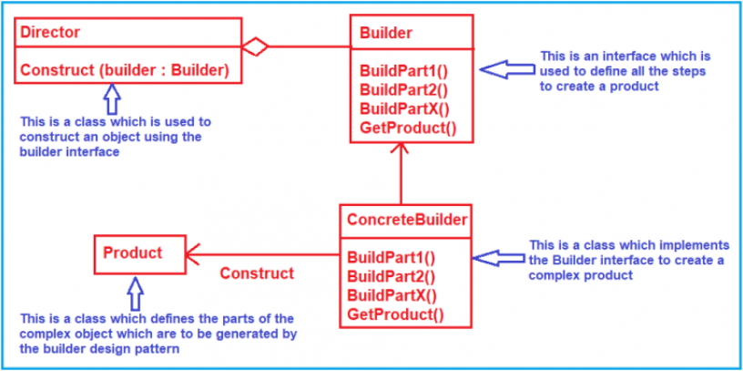
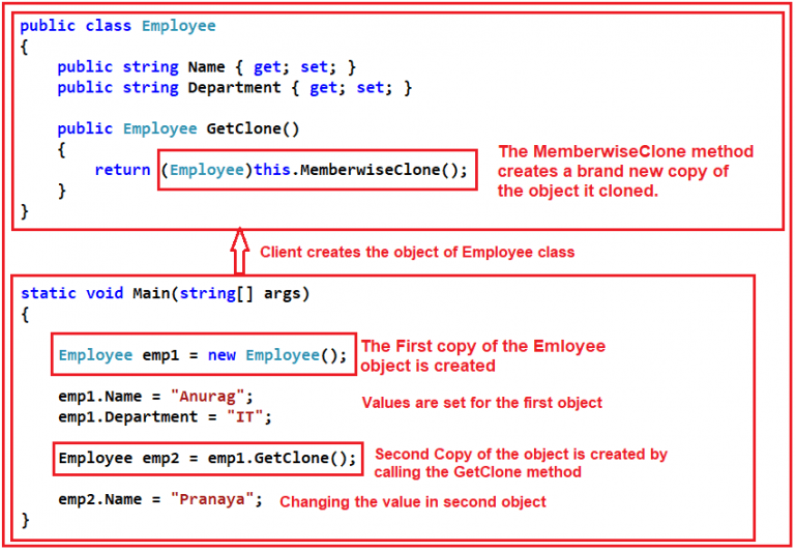
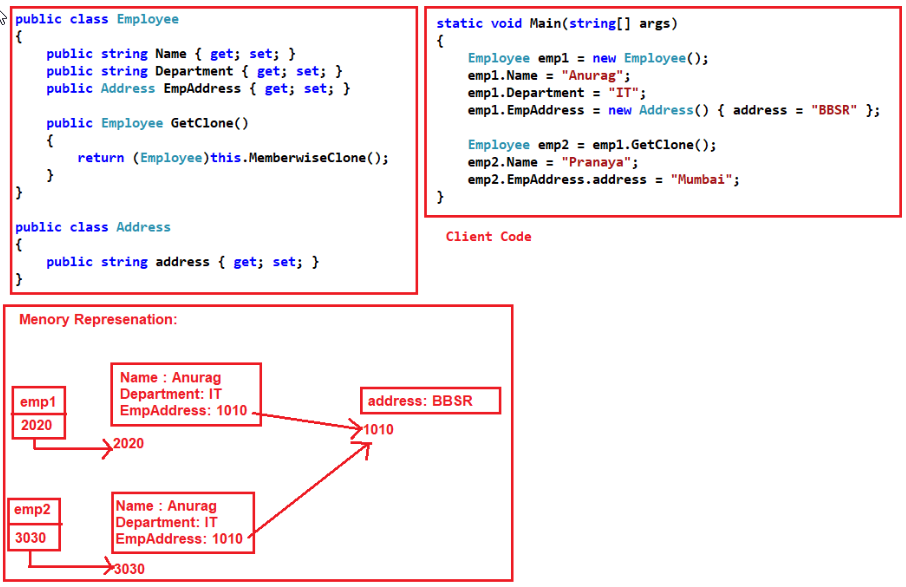
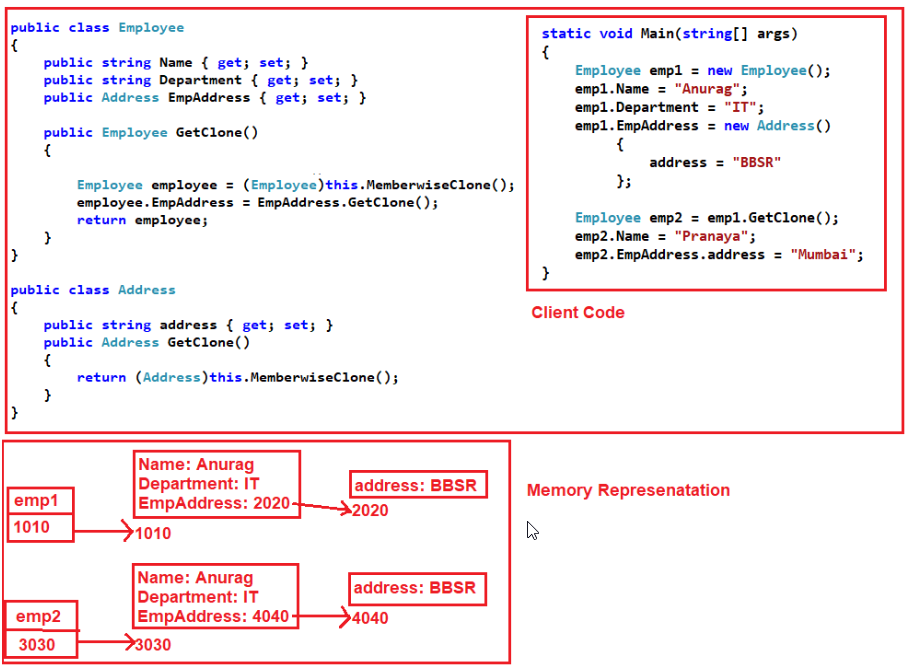

.. include:: include.rst

.. _creational_design_pattern:

###########################
Creational Pattern Concepts
###########################

**Design Patterns** are a reusable, high quality solution to a given task or 
recurring problem and are commonly defined as time-tested solutions.

The **Creational Design Pattern** deals with object creation mechanisms.
It trying to create objects in a manner suitable to the situation. 
It focuses on how the objects are created and utilized in an application.

**When to use the Creational Design Pattern?**

In real-time applications, the project is created with a lot of classes. A lot of classes mean we are going to deal with a lot of objects.
If these objects creations are scattered on the client code, then it leads to a lot of complicated logic at the client code. 
The Creational Design Pattern helps us to centralize the object creation logic.

***************
Builder Pattern
***************

The Builder Design Pattern builds a complex object using many simple objects and using a step by step approach.

The Process of constructing a complex object should be generic so that the same construction process can be used to create different representations of the same complex object.

It’s especially useful when you need to create an object with lots of possible configuration options.

Without this pattern, we can end up with a large constructor to provide all the required parameters for constructing our object. That could lead to quite unreadable and hardly maintainable code. 
Furthermore, a constructor with lots of parameters has a downside to it. We won’t need to use all the parameters, all the time.

**Identification**

The Builder pattern can be recognized in class, which has a single creation method and several methods to configure the resulting object. 
Builder methods often support chaining (for example, someBuilder->setValueA(1)->setValueB(2)->create()).

Reference_1 : `Builder Design Pattern blog 1 <https://dotnettutorials.net/lesson/builder-design-pattern/>`_

Reference_2 : `Builder Design Pattern blog 2 <https://refactoring.guru/design-patterns/builder/csharp/example>`_

*************************
Fluent Interface Pattern
*************************

The main objective of the Fluent Interface Design Pattern is that we can apply multiple properties (or methods) to an object by connecting them with dots (.) without having to re-specify the object name each time.

Its makes our interface simpler.

**Note:** The Fluent Interfaces and Method chaining are related to each other. Or we can say that one is a concept and the other one is its implementation.

Fluent interfaces are used extensively in LINQ Queries like Searching, Sorting, pagination, grouping etc

.. code-block:: c#
   :caption: Fluent Interface code example

      using System;

      namespace FluentInterfaceDesignPattern
      {
         class Program
         {
            static void Main(string[] args)
            {
                  FluentEmployee obj = new FluentEmployee();

                  obj.NameOfTheEmployee("Anurag Mohanty")
                        .Born("10/10/1992")
                        .WorkingOn("IT")
                        .StaysAt("Mumbai-India");
                  
                  Console.Read();
            }
         }

         public class Employee
         {
            public string FullName { get; set; }
            public DateTime DateOfBirth { get; set; }
            public string Department { get; set; }
            public string Address { get; set; }
         }

         public class FluentEmployee
         {
            private Employee employee = new Employee();

            public FluentEmployee NameOfTheEmployee(string FullName)
            {
                  employee.FullName = FullName;
                  return this;
            }

            public FluentEmployee Born(string DateOfBirth)
            {
                  employee.DateOfBirth = Convert.ToDateTime(DateOfBirth);
                  return this;
            }

            public FluentEmployee WorkingOn(string Department)
            {
                  employee.Department = Department;
                  return this;
            }

            public FluentEmployee StaysAt(string Address)
            {
                  employee.Address = Address;
                  return this;
            }
         }
      }

Reference : `Fluent Interface Pattern blog <https://dotnettutorials.net/lesson/fluent-interface-design-pattern/>`_

***************
Factory Pattern
***************

**Factory Design Pattern** states that “A factory is an object which is used for creating other objects”. 

* we can say that a factory is a class with a method. 
* That method will create and return different types of objects based on the input parameter, it received.

we create an object without exposing the creation logic to the client and the client will refer to the newly created object using a common interface.

**Where to use Factory design Pattern ?**

If we have a superclass and n number of subclasses, and based on the data provided, if we have to create and return the object of one of the subclasses, 
then we need to use the factory design pattern.

* The Object needs to be extended to the subclasses
* Classes don’t know what exact sub-classes it has to create
* The Product implementation going to change over time and the Client remains unchanged

**Problems of Simple Factory Design Pattern in C#**

If we need to add any new product then we need to add a new if else condition in the object creation method of the Factory class. This violates the **open/closed** design principle.
We also have a tight coupling between the Factory class and product classes.

Reference : `Factory Design Pattern blog <https://dotnettutorials.net/lesson/factory-design-pattern-csharp/>`_

**********************
Factory Method Pattern
**********************

The Factory Method Design Pattern is used, when we need to create the object without exposing the object creation logic to the client. 
To achieve this, in the factory method design pattern, we will create an abstract class as the Factory class which will create and return the instance of the product, but 
it will let the subclasses decide which class to instantiate.

.. image:: images/FactoryMethodPattern.png
   :width: 700

According to Gang of Four, we need to define an interface or abstract class for creating an object. In our example, it is an abstract class i.e. CreditCardFactory class. 

The second part of the definition saying that let the subclasses decide which class to instantiate. In our example, the subclasses are PlatinumFactory, MoneyBackFactory, and TitaniumFactory. 

So these subclasses will decide which class to instantiate, for example, MoneyBack, Titanium, and Platinum.

Reference : `Factory Method Design Pattern blog <https://dotnettutorials.net/lesson/factory-method-design-pattern-csharp/>`_

************************
Abstract Factory Pattern
************************

The Abstract Factory Design Pattern provides a way to encapsulate a group of individual factories that have a common theme without specifying their concrete classes.

Abstract Factory is a super factory that creates other factories. This Factory is also called Factory of Factories.

When to use it Abstract Factory Design Pattern?

* When you want to create a set of related objects or dependent objects which must be used together.
* When the system should configure to work with multiple families of products.
* When the Concrete classes should be decoupled from the clients.

Abstract Factory Design Pattern adds a layer of abstraction to the Factory Method Design Pattern

Reference : `Abstract Factory Design Pattern blog <https://dotnettutorials.net/lesson/abstract-factory-design-pattern-csharp/>`_

******************
Prototype Pattern
******************

Prototype Design Pattern gives us a way to create new objects from the existing instance of the object. 

That means it clone the existing object with its data into a new object. If we do any changes to the cloned object (i.e. new object) then it does not affect the original object.

When we talk about object cloning it means it is all about the call by value. So, if we do any changes to one object then it will not affect the other object. 
Let us see how to clone the object to another object. To do so, C# provides one method i.e. **MemberwiseClone** which will create a new complete copy of the object.

**Points to Remember:**

* The MemberwiseClone method is part of the System.Object class and it creates a **shallow copy** of the given object. 
* MemberwiseClone Method only copies the non-static fields of the object to the new object
* In the process of copying, if a field is a value type, a bit by bit copy of the field is performed. If a field is a reference type, the reference is copied but the referenced object is not.

Reference : `Prototype Design Pattern blog <https://dotnettutorials.net/lesson/prototype-design-pattern/>`_

**Shallow Copy Vs Deep Copy**

**Understanding Shallow Copy in C#:**

In the case of **Shallow copy**, it will create the new object from the existing object and then copying the **value type fields** of the current object to the new object. 
But in the case of reference type, it will only copy the reference, not the referred object itself. 
Therefore the original and clone refer to the same object in case of reference type.

**Understanding Deep Copy in C#:**

In the case of **deep copy**, it will create the new object from the existing object and then copying the **fields** of the current object to the newly created object. 
If the field is a value type, then a bit-by-bit copy of the field will be performed. If the field is a reference type, then a new copy of the referred object is created.

Reference : `Shallow Copy Vs Deep Copy blog <https://dotnettutorials.net/lesson/shallow-copy-and-deep-copy/>`_

******************
Singleton Pattern
******************

Singleton Design Pattern ensures that only one instance of a particular class is going to be created and 
then provide simple point of access to that instance for the entire application.

Identification: Singleton can be recognized by a static creation method, which returns the same cached object.

.. code-block:: c#
   :caption: **No Thread-Safe** Singleton Design Pattern code example

      namespace SingletonDemo
      {
         public sealed class Singleton
         {
            private static int counter = 0;
            private static Singleton instance = null;
            public static Singleton GetInstance
            {
                  get
                  {
                     if (instance == null)
                        instance = new Singleton();
                     return instance;
                  }
            }
            
            private Singleton()
            {
                  counter++;
                  Console.WriteLine("Counter Value " + counter.ToString());
            }
            public void PrintDetails(string message)
            {
                  Console.WriteLine(message);
            }
         }
      }

**Thread-safe Singleton Design Pattern**

The lazy initialization i.e. the on-demand object creation of the singleton class works fine when we invoke the GetInstance property in a Single-threaded environment. 
But in a multi-thread environment, the lazy initialization may end up creating multiple instances of the singleton class when multiple threads invoke the GetInstance property parallelly at the same time.

We can use Locks in C# to control the thread race condition in a multithreaded environment.

.. code-block:: c#
   :caption: **Thread-Safe Multi-Threaded** Singleton Design Pattern code example

      namespace SingletonDemo
      {
         public sealed class Singleton
         {
            private static int counter = 0;
            private static readonly object Instancelock = new object();
            private Singleton()
            {
                  counter++;
                  Console.WriteLine("Counter Value " + counter.ToString());
            }
            private static Singleton instance = null;
            
            public static Singleton GetInstance
            {
                  get
                  {
                     lock (Instancelock)
                     {
                        if (instance == null)
                        {
                              instance = new Singleton();
                        }
                        return instance;
                     }
                  }
            }
            
            public void PrintDetails(string message)
            {
                  Console.WriteLine(message);
            }
         }
      }

The above code implementation using lock solves the multithreading issue. But the problem is that it is slow down your application as only one thread can access the GetInstance property at any given point of time. 
We can overcome the above problem by using the **Double-checked locking** mechanism.

In the **Double-checked locking** mechanism, first, we will check whether the instance is created or not. 
If not then only we will synchronize the method as shown below.

.. code-block:: c#
   :caption: **Double-checked locking** Singleton Design Pattern code example

      public static Singleton GetInstance
        {
            get
            {
                if (instance == null)
                {
                    lock (Instancelock)
                    {
                        if (instance == null)
                        {
                            instance = new Singleton();
                        }
                    }
                }
                return instance;
            }
        }

**What is Non-Lazy or Eager Loading in C# ?**

The Eager loading in singleton design pattern is nothing a process in which we need to initialize the singleton object at the **time of application start-up** rather than on-demand and keep it ready in memory to be used in the future. 

The advantage of using Eager Loading in the Singleton design pattern is that the CLR (Common Language Runtime) will take care of object initialization and thread-safety.

.. code-block:: c#
   :caption: **Non-Lazy or Eager Loading** Singleton Design Pattern code example

      private static readonly Singleton singleInstance = new Singleton(); 
        
        public static Singleton GetInstance
        {
            get
            {
                return singleInstance;
            }
        }

**What is Lazy or Deferred Loading in C# ?**

The Lazy or Deferred Loading is a design pattern or you can say its a concept which is commonly used to delay the initialization of an object until the point at which it is needed. 
So the main objective of Lazy loading is to load the object on-demand or you can say object when needed.

**When to use Lazy Loading ?**

* When the cost of the object creation is very high as well as the use of that object is very rare. 

* The lazy loading improves the performance of an application if it is used properly. 

We can use the Lazy keyword to make the singleton instance as lazy loading as below,

.. code-block:: c#
   :caption: **Lazy keyword** Singleton Design Pattern code example

      // We need to pass a delegate to the constructor which calls the Singleton constructor, 
         which is done most easily with a lambda expression.

      private static readonly Lazy<Singleton> Instancelock = new Lazy<Singleton>(() => new Singleton());

        public static Singleton GetInstance
        {
            get
            {
                return Instancelock.Value;
            }
        }

