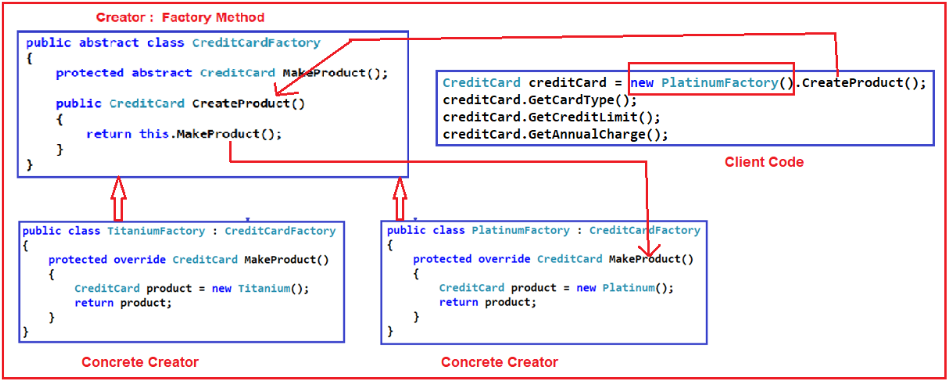

.. include:: include.rst

.. _creational_design_pattern:

###########################
Creational Pattern Concepts
###########################

**Design Patterns** are a reusable, high quality solution to a given task or 
recurring problem and are commonly defined as time-tested solutions.

The **Creational Design Pattern** deals with object creation mechanisms.
It trying to create objects in a manner suitable to the situation. 
It focuses on how the objects are created and utilized in an application.

**When to use the Creational Design Pattern?**

In real-time applications, the project is created with a lot of classes. A lot of classes mean we are going to deal with a lot of objects.
If these objects creations are scattered on the client code, then it leads to a lot of complicated logic at the client code. 
The Creational Design Pattern helps us to centralize the object creation logic.

***************
Builder Pattern
***************

About Builder Pattern

***************
Factory Pattern
***************

**Factory Design Pattern** states that “A factory is an object which is used for creating other objects”. 

* we can say that a factory is a class with a method. 
* That method will create and return different types of objects based on the input parameter, it received.

we create an object without exposing the creation logic to the client and the client will refer to the newly created object using a common interface.

**Where to use Factory design Pattern ?**

If we have a superclass and n number of subclasses, and based on the data provided, if we have to create and return the object of one of the subclasses, 
then we need to use the factory design pattern.

* The Object needs to be extended to the subclasses
* Classes don’t know what exact sub-classes it has to create
* The Product implementation going to change over time and the Client remains unchanged

**Problems of Simple Factory Design Pattern in C#**

If we need to add any new product then we need to add a new if else condition in the object creation method of the Factory class. This violates the **open/closed** design principle.
We also have a tight coupling between the Factory class and product classes.

Reference : `Factory Design Pattern blog <https://dotnettutorials.net/lesson/factory-design-pattern-csharp/>`_

**********************
Factory Method Pattern
**********************

The Factory Method Design Pattern is used, when we need to create the object without exposing the object creation logic to the client. 
To achieve this, in the factory method design pattern, we will create an abstract class as the Factory class which will create and return the instance of the product, but 
it will let the subclasses decide which class to instantiate.

According to Gang of Four, we need to define an interface or abstract class for creating an object. In our example, it is an abstract class i.e. CreditCardFactory class. 

The second part of the definition saying that let the subclasses decide which class to instantiate. In our example, the subclasses are PlatinumFactory, MoneyBackFactory, and TitaniumFactory. 

So these subclasses will decide which class to instantiate, for example, MoneyBack, Titanium, and Platinum.

Reference : `Factory Method Design Pattern blog <https://dotnettutorials.net/lesson/factory-method-design-pattern-csharp/>`_

************************
Abstract Factory Pattern
************************

