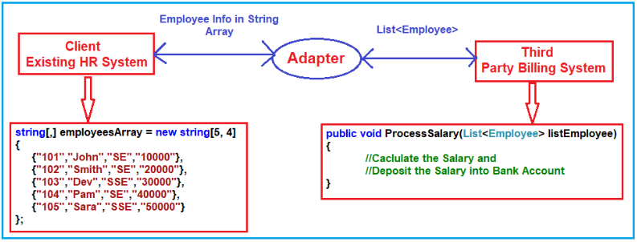
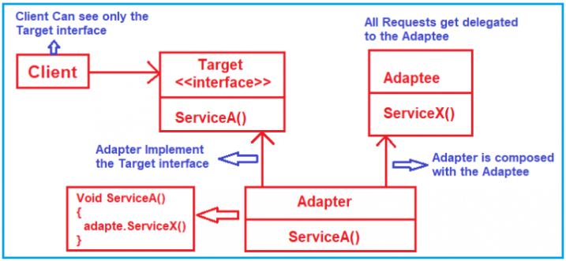
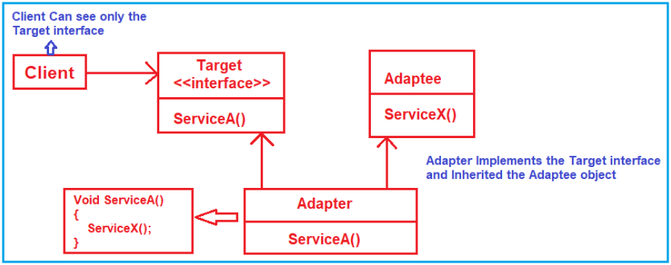
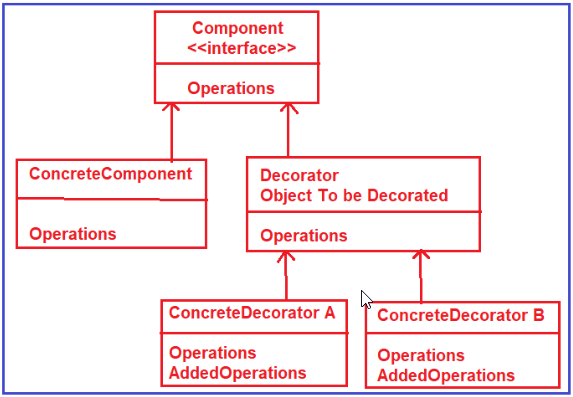
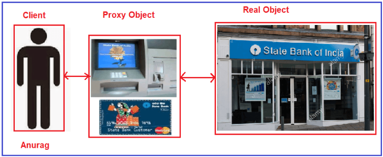
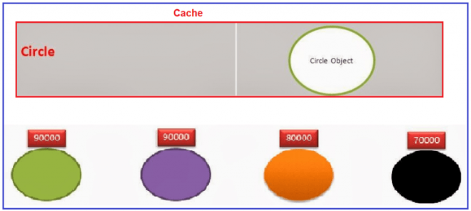
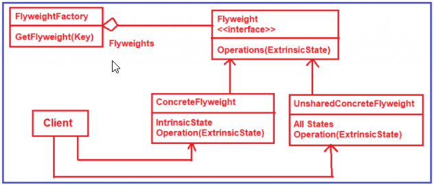

.. include:: include.rst

.. _structural_design_pattern:

###########################
Structural Pattern Concepts
###########################

**Structural patterns** explain how to assemble objects and classes into larger structures while keeping these structures flexible and efficient.

***************
Adapter Pattern
***************

The **Adapter Design Pattern** *works as a bridge between two incompatible interfaces* or *helps two incompatible interfaces to work together*. 

This design pattern involves a single class called adapter which is responsible for communication between two independent or incompatible interfaces.

Pattern can be implemented in two ways. They are as follows.

* Object Adapter Pattern
* Class Adapter Pattern

**Understanding Object Adapter Pattern in C#:**

An Object Adapter delegates to an adaptee object.

**Adapter:** This is a class which makes two incompatible systems to work together. The Adapter class implements the Trager interface and provides the implementation for the ServiceA method. 
This class is also composed of the Adaptee i.e. it has a reference to the Adaptee object.

**Understanding Class Adapter Pattern in C#:**

In this approach, the Adapter calls the methods inherited from the Adaptee class.

In the case of Object Adapter pattern, the adapter has a reference to the Adaptee object and using that reference it will call the adaptee met

But in the case of Class Adapter Pattern, the adapter will call the inherited method of the Adaptee class.

**When to use the Object Adapter pattern and when to use the Class Adapter Pattern in C#?**

If you have a java class and you want to make it compatible with dot net class, then you need to use the object adapter pattern and the reason is it is not possible to make inheritance. 

On the other hand, if both the classes are within the same project and using the same programming language and if the inheritance is possible then you need to go for Class Adapter Pattern.

**When to use the Adapter Design Pattern in the real-time application?**

* When a class needs to be reused that does not have an interface that a client requires.
* Allow a system to use classes of another system that is incompatible with it.
* Allow communication between a new and already existing system which are independent of each other.

Reference : `Adapter Design Pattern blog <https://dotnettutorials.net/lesson/adapter-design-pattern/>`_

**************
Facade Pattern
**************

**Facade Design Pattern** is used to hide the complexities of a system and provides an interface to the client using which the client can access the system.
or it is an higher-level interface that makes the subsystem easier to use.

.. image:: images/Facade_pattern_1.png
   :width: 700

Here the extra class Order is the Façade class which will take the responsibility of placing the order. 
This class internally creates the instance of the respective classes and calls the method.

.. image:: images/Facade_pattern_2.png
   :width: 700

The **Facade class** knows which subsystem classes are responsible for a given request and then it delegates the client requests to appropriate subsystem objects.

The Subsystem classes Implement their respective functionalities assigned to them and these subsystems do not have any knowledge of the facade.

**When to use Facade Design Pattern?**

* When we want to provide a simple interface to a complex subsystem. Subsystems often get more complex as they evolve.
* There are many dependencies between clients and the implementation classes

Reference : `Facade Design Pattern blog <https://dotnettutorials.net/lesson/facade-design-pattern/>`_

*****************
Decorator Pattern
*****************

The **Decorator Design Pattern** allows us to dynamically add new functionalities to an existing object without altering or modifying its structure.

This pattern adds additional functionalities to the object by wrapping it.

**Identification:** Decorator can be recognized by creation methods or constructor that accept objects of the same class or interface as a current class.

.. code-block:: c#
    :caption: Decorator Pattern code example
               
        using System;

        namespace RefactoringGuru.DesignPatterns.Composite.Conceptual
        {
            // The base Component interface defines operations that can be altered by
            // decorators.
            public abstract class Component
            {
                public abstract string Operation();
            }

            // Concrete Components provide default implementations of the operations.
            // There might be several variations of these classes.
            class ConcreteComponent : Component
            {
                public override string Operation()
                {
                    return "ConcreteComponent";
                }
            }

            // The base Decorator class follows the same interface as the other
            // components. The primary purpose of this class is to define the wrapping
            // interface for all concrete decorators. The default implementation of the
            // wrapping code might include a field for storing a wrapped component and
            // the means to initialize it.
            abstract class Decorator : Component
            {
                protected Component _component;

                public Decorator(Component component)
                {
                    this._component = component;
                }

                public void SetComponent(Component component)
                {
                    this._component = component;
                }

                // The Decorator delegates all work to the wrapped component.
                public override string Operation()
                {
                    if (this._component != null)
                    {
                        return this._component.Operation();
                    }
                    else
                    {
                        return string.Empty;
                    }
                }
            }

            // Concrete Decorators call the wrapped object and alter its result in some
            // way.
            class ConcreteDecoratorA : Decorator
            {
                public ConcreteDecoratorA(Component comp) : base(comp)
                {
                }

                // Decorators may call parent implementation of the operation, instead
                // of calling the wrapped object directly. This approach simplifies
                // extension of decorator classes.
                public override string Operation()
                {
                    return "ConcreteDecoratorA({base.Operation()})";
                }
            }

            // Decorators can execute their behavior either before or after the call to
            // a wrapped object.
            class ConcreteDecoratorB : Decorator
            {
                public ConcreteDecoratorB(Component comp) : base(comp)
                {
                }

                public override string Operation()
                {
                    return "ConcreteDecoratorB({base.Operation()})";
                }
            }
            
            public class Client
            {
                // The client code works with all objects using the Component interface.
                // This way it can stay independent of the concrete classes of
                // components it works with.
                public void ClientCode(Component component)
                {
                    Console.WriteLine("RESULT: " + component.Operation());
                }
            }
            
            class Program
            {
                static void Main(string[] args)
                {
                    Client client = new Client();

                    var simple = new ConcreteComponent();
                    Console.WriteLine("Client: I get a simple component:");
                    client.ClientCode(simple);
                    Console.WriteLine();

                    // ...as well as decorated ones.
                    //
                    // Note how decorators can wrap not only simple components but the
                    // other decorators as well.
                    ConcreteDecoratorA decorator1 = new ConcreteDecoratorA(simple);
                    ConcreteDecoratorB decorator2 = new ConcreteDecoratorB(decorator1);
                    Console.WriteLine("Client: Now I've got a decorated component:");
                    client.ClientCode(decorator2);
                }
            }
        }

Reference_1 : `Decorator Design Pattern blog 1 <https://dotnettutorials.net/lesson/decorator-design-pattern/>`_   
        
Reference_2 : `Decorator Design Pattern blog 2 <https://refactoring.guru/design-patterns/decorator/csharp/example>`_

Reference Real-time Example : `Decorator Example <https://dotnettutorials.net/lesson/decorator-design-pattern-real-time-example/>`_

**************
Bridge Pattern
**************

**Bridge Pattern** “*Decouples an abstraction from its implementation so that the two can vary independently*“.

The Bridge Design Pattern separates the abstraction hierarchy and the implementation hierarchy in two different layers so that change in one hierarchy will not affect the development or functionality of other hierarchy.

The client code can access only the abstraction part without being concerned about the implementation part.

**Usage examples:** The Bridge pattern is especially useful when dealing with cross-platform apps, supporting multiple types of database servers or working with several API providers of a certain kind 
(for example, cloud platforms, social networks, etc.)

.. code-block:: c#
    :caption: Bridge Pattern code example

        using System;

        namespace RefactoringGuru
        {
            // The Abstraction defines the interface for the "control" part of the two
            // class hierarchies. It maintains a reference to an object of the
            // Implementation hierarchy and delegates all of the real work to this
            // object.
            class Abstraction
            {
                protected IImplementation _implementation;
                
                public Abstraction(IImplementation implementation)
                {
                    this._implementation = implementation;
                }
                
                public virtual string Operation()
                {
                    return "Abstract: Base operation with:\n" + 
                        _implementation.OperationImplementation();
                }
            }

            // You can extend the Abstraction without changing the Implementation
            // classes.
            class ExtendedAbstraction : Abstraction
            {
                public ExtendedAbstraction(IImplementation implementation) : base(implementation)
                {
                }
                
                public override string Operation()
                {
                    return "ExtendedAbstraction: Extended operation with:\n" +
                        base._implementation.OperationImplementation();
                }
            }

            // The Implementation defines the interface for all implementation classes.
            // It doesn't have to match the Abstraction's interface. In fact, the two
            // interfaces can be entirely different. Typically the Implementation
            // interface provides only primitive operations, while the Abstraction
            // defines higher- level operations based on those primitives.
            public interface IImplementation
            {
                string OperationImplementation();
            }

            // Each Concrete Implementation corresponds to a specific platform and
            // implements the Implementation interface using that platform's API.
            class ConcreteImplementationA : IImplementation
            {
                public string OperationImplementation()
                {
                    return "ConcreteImplementationA: The result in platform A.\n";
                }
            }

            class ConcreteImplementationB : IImplementation
            {
                public string OperationImplementation()
                {
                    return "ConcreteImplementationA: The result in platform B.\n";
                }
            }

            class Client
            {
                // Except for the initialization phase, where an Abstraction object gets
                // linked with a specific Implementation object, the client code should
                // only depend on the Abstraction class. This way the client code can
                // support any abstraction-implementation combination.
                public void ClientCode(Abstraction abstraction)
                {
                    Console.Write(abstraction.Operation());
                }
            }
            
            class Program
            {
                static void Main(string[] args)
                {
                    Client client = new Client();

                    Abstraction abstraction;
                    // The client code should be able to work with any pre-configured
                    // abstraction-implementation combination.
                    abstraction = new Abstraction(new ConcreteImplementationA());
                    client.ClientCode(abstraction);
                    
                    Console.WriteLine();
                    
                    abstraction = new ExtendedAbstraction(new ConcreteImplementationB());
                    client.ClientCode(abstraction);
                }
            }
        }

*****************
Composite Pattern
*****************

The **Composite Design Pattern** allows us to have a tree structure and ask each node in the tree structure to perform a task.

The composite design pattern is used when we need to treat a group of objects in a similar way as a single object.

.. code-block:: c#
    :caption: Composite Pattern code example

        public interface IComponent
        {
            void DisplayPrice();
        }

        public class Leaf : IComponent
        {
            public int Price { get; set; }
            public string Name { get; set; }
            public Leaf(string name, int price)
            {
                this.Price = price;
                this.Name = name;
            }
            
            public void DisplayPrice()
            {
                Console.WriteLine(Name +" : "+ Price);
            }
        }

        public class Composite : IComponent
        {
            public string Name { get; set; }
            List<IComponent> components = new List<IComponent>();
            public Composite(string name)
            {
                this.Name = name;
            }
            public void AddComponent(IComponent component)
            {
                components.Add(component);
            }
            
            public void DisplayPrice()
            {
                Console.WriteLine(Name);
                foreach (var item in components)
                {
                    item.DisplayPrice();
                }
            }
        }

        public class Program
        {
            static void Main(string[] args)
            {
                //Creating Leaf Objects
                IComponent hardDisk = new Leaf("Hard Disk", 2000);
                IComponent ram = new Leaf("RAM", 3000);
                IComponent cpu = new Leaf("CPU", 2000);
                IComponent mouse = new Leaf("Mouse", 2000);
                IComponent keyboard = new Leaf("Keyboard", 2000);

                //Creating composite objects
                Composite motherBoard = new Composite("Peripherals");
                Composite cabinet = new Composite("Cabinet");
                Composite peripherals = new Composite("Peripherals");
                Composite computer = new Composite("Computer");

                //Creating tree structure
                //Ading CPU and RAM in Mother board
                motherBoard.AddComponent(cpu);
                motherBoard.AddComponent(ram);

                //Ading mother board and hard disk in Cabinet
                cabinet.AddComponent(motherBoard);
                cabinet.AddComponent(hardDisk);

                //Ading mouse and keyborad in peripherals
                peripherals.AddComponent(mouse);
                peripherals.AddComponent(keyboard);

                //Ading cabinet and peripherals in computer
                computer.AddComponent(cabinet);
                computer.AddComponent(peripherals);

                //To display the Price of Computer
                computer.DisplayPrice();
                Console.WriteLine();

                //To display the Price of Keyboard
                keyboard.DisplayPrice();
                Console.WriteLine();
                
                //To display the Price of Cabinet
                cabinet.DisplayPrice();
                Console.Read();
            }
        }

**Use the Composite pattern when you have to implement a tree-like object structure.**

* The Composite pattern provides you with two basic element types that share a common interface: simple leaves and complex containers. 
  A container can be composed of both leaves and other containers. This lets you construct a nested recursive object structure that resembles a tree.

**Use the pattern when you want the client code to treat both simple and complex elements uniformly.**

* All elements defined by the Composite pattern share a common interface. Using this interface, the client doesn’t have to worry about the concrete class of the objects it works with.

*************
Proxy Pattern
*************

**Proxy** is a structural design pattern that lets you provide a substitute or placeholder for another object. 

proxy is a class functioning as an interface to something else. The proxy could interface to anything such as a network connection, a large object in memory, a file or some other resources that are expensive or impossible to duplicate.

**Types of Proxies:**

**Virtual Proxy:** A virtual proxy is a place holder for “expensive to create” objects. The real object is only created when a client first requests or accesses the object.

**Remote Proxy:** A remote proxy provides local representation for an object that resides in a different address space.

**Protection Proxy:** A protection proxy control access to a sensitive master object. The surrogate object checks that the caller has the access permissions required prior to forwarding the request.

**Why do we need Proxy Design Pattern in C#?**

**Improve Performance:** 

It saves the results of a request for a certain period of time. When the client send same request, insread of forward to real server, it can simply return the data from the cache. 
Since the client and the proxy server are in the same network, so it is going to be a much faster operation.

**Filter Requests:**

The Proxy servers can also be used to filter the incoming requests. For example, a company might use the proxy server to prevent its employees from accessing a specific set of websites such as Facebook, Twitter, etc.

.. code-block:: c#
    :caption: Proxy Pattern code example

        public class Employee
        {
            public string Username { get; set; }
            public string Password { get; set; }
            public string Role { get; set; }
            public Employee(string username, string password, string role)
            {
                Username = username;
                Password = password;
                Role = role;
            }
        }

        public interface ISharedFolder
        {
            void PerformRWOperations();
        }

        public class SharedFolder : ISharedFolder
        {
            public void PerformRWOperations()
            {
                Console.WriteLine("Performing Read Write operation on the Shared Folder");
            }
        }

        class SharedFolderProxy : ISharedFolder
        {
            private ISharedFolder folder;
            private Employee employee;
            public SharedFolderProxy(Employee emp)
            {
                employee = emp;
            }
            public void PerformRWOperations()
            {
                if (employee.Role.ToUpper() == "CEO" || employee.Role.ToUpper() =="MANAGER")
                {
                    folder = new SharedFolder();
                    Console.WriteLine("Shared Folder Proxy makes call to the RealFolder 'PerformRWOperations method'");
                    folder.PerformRWOperations();
                }
                else
                {
                    Console.WriteLine("Shared Folder proxy says 'You don't have permission to access this folder'");
                }
            }
        }

        class Program
        {
            static void Main(string[] args)
            {
                Console.WriteLine("Client passing employee with Role Developer to folderproxy");
                Employee emp1 = new Employee("Anurag", "Anurag123", "Developer");
                SharedFolderProxy folderProxy1 = new SharedFolderProxy(emp1);
                folderProxy1.PerformRWOperations();
                Console.WriteLine();
                Console.WriteLine("Client passing employee with Role Manager to folderproxy");
                Employee emp2 = new Employee("Pranaya", "Pranaya123", "Manager");
                SharedFolderProxy folderProxy2 = new SharedFolderProxy(emp2);
                folderProxy2.PerformRWOperations();
                Console.Read();
            }
        }

*****************
Flyweight Pattern
*****************

The **Flyweight Design Pattern** is used when there is a need to create a large number of objects of almost similar nature. 
A large number of objects consumes a large amount of memory and the Flyweight design pattern provides a solution for reducing the load on memory by sharing objects.

*The different States in the Flyweight Design Pattern*:

* Intrinsic - Intrinsic states are things that are constants and stored in memory.
* Extrinsic - extrinsic states are things that are not constant and need to be calculated on the Fly and are therefore not stored in the memory.

.. code-block:: c#
    :caption: Flyweight Pattern code example

        public interface Shape
        {
            void Draw();
        }

        public class Circle : Shape
        {
            public string Color { get; set; }
            private int XCor = 10;
            private int YCor = 20;
            private int Radius = 30;
            
            public void SetColor(string Color)
            {
                this.Color = Color;
            }
            public void Draw()
            {
                Console.WriteLine(" Circle: Draw() [Color : " + Color + ", X Cor : " + XCor + ", YCor :" + YCor + ", Radius :"
                        + Radius);
            }
        }

        public class ShapeFactory
        {
            private static Dictionary<string, Shape> shapeMap = new Dictionary<string, Shape>();
            public static Shape GetShape(string shapeType)
            {
                Shape shape = null;
                if (shapeType.Equals("circle", StringComparison.InvariantCultureIgnoreCase))
                {
                    if (shapeMap.TryGetValue("circle", out shape))
                    {
                    }
                    else
                    {
                        shape = new Circle();
                        shapeMap.Add("circle", shape);
                        Console.WriteLine(" Creating circle object with out any color in shapefactory \n");
                    }
                }
                return shape;
            }
        }

        class Program
        {
            static void Main(string[] args)
            {
                Console.WriteLine("\n Red color Circles ");
                for (int i = 0; i < 3; i++)
                {
                    Circle circle = (Circle)ShapeFactory.GetShape("circle");
                    circle.SetColor("Red");
                    circle.Draw();
                }
                Console.WriteLine("\n Green color Circles ");
                for (int i = 0; i < 3; i++)
                {
                    Circle circle = (Circle)ShapeFactory.GetShape("circle");
                    circle.SetColor("Green");
                    circle.Draw();
                }    
            }
        }

