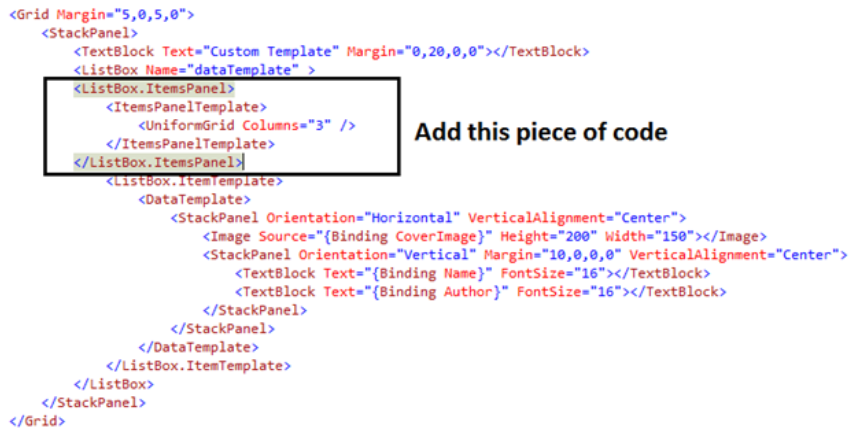

.. include:: include.rst

.. _wpf_concepts:

############
WPF Concepts
############

************
Data Binding
************

About Data Binding

*********
Templates
*********

About Control template and data template

Reference : `Template blog <https://www.c-sharpcorner.com/article/different-types-of-templates-in-wpf/>`_

*********
Resources
*********

Resources are objects which can be reused anywhere in a WPF application. For example styles, brushes, Bitmap images etc. can be used as resources in different places in your WPF application.

 list of place where your resources can be declared:

* As global application scope within the application **App.xaml** file.

* As Window level scope within the Resources property of the current Window.

* Within the Resources property of any FrameworkElement or FrameworkContentElement.

* Separate XAML resource file.

1. Static Resource - Static resources are the resources which you cannot manipulate at runtime. 
                     The static resources are evaluated only once by the element which refers them during the loading of XAML.

2. Dynamic Resource - Dynamic resources are the resources which you can manipulate at runtime and are evaluated at runtime.
                      If your code behind changes the resource, the elements referring resources as dynamic resources will also change.

**Note:** Using Static Resources improves the performance of your WPF application. When you are using Dynamic Resources, make sure that the Element Properties must be Dependency Property.
This behavior is because, DPs have Change Notification support implicitly implemented, which in turn updates your UI.

**Declare and refer resources in Resource Dictionary**

To add a Resource Dictionary into your WPF application, right click the WPF project > add a Resource Dictionary.

<ResourceDictionary xmlns="http://schemas.microsoft.com/winfx/2006/xaml/presentation"
                    xmlns:x="http://schemas.microsoft.com/winfx/2006/xaml">
    <LinearGradientBrush StartPoint="0,0" EndPoint="1,1" x:Key="myBackgroundColor">
        <GradientStop Offset="0" Color="Green"/>
        <GradientStop Offset="0.4" Color="PeachPuff"/>
        <GradientStop Offset="0.7" Color="Pink"/>
        <GradientStop Offset="1" Color="Silver"/>
    </LinearGradientBrush>
    <Thickness x:Key="MarginTop">0 5 5 0</Thickness>  
    <SolidColorBrush x:Key="SolidAquamarine" Color="Aquamarine"/>

    <SolidColorBrush Color="Red" x:Key="buttonRedBackground"/>
</ResourceDictionary>

//Usage
<Button x:Name="SubmitButton"    
               Background="{StaticResource myBackgroundColor}"    
               BorderBrush="{StaticResource SolidAquamarine}"
               Margin="{StaticResource MarginTop}"
               Content="Submit"    
               Height="20"    
               Width="100"/>

<Button Name="Button1" Content="Button - Static Resource" Background="{StaticResource buttonRedBackground}"/>

<Button Name="Button2" Content="Button- Dynamic Resource" Background="{DynamicResource buttonRedBackground}"/>

//Usage 1 
this.Resources["buttonRedBackground"] = Brushes.Green;

//Usage 2

this.Resources["ButtonExitBackgroundColor"] = new SolidColorBrush(Colors.LightGray);  
this.Resources["ButtonExitBorderColor"] = new SolidColorBrush(Colors.Black);

Color is not applied on the **ExitButton** at compile-time, as the .NET framework resolves it at runtime.

Once you declare the resource dictionary, you can refer them at application level as shown below -

<Application.Resources>
    <ResourceDictionary>
        <ResourceDictionary.MergedDictionaries>
            <ResourceDictionary Source="MyResourcesDictionary.xaml"/>
        </ResourceDictionary.MergedDictionaries>
    </ResourceDictionary>
</Application.Resources>

**Implicit Styling**

Applying style to all the specific control (Button,Label etc) used all over the xaml.
This is inefficient because we might not need to apply same style for all control(button).
For that we have to override some of the settings in xaml.

.. code-block:: xaml
   :caption: Implicit example
        

        

**Explicit Styling**

To avoid the problem of overriding the property for some controls, we can use explicit styling as below,

.. code-block:: xaml
   :caption: Explicit example
        <SolidColorBrush x:Key="numbersColor" Color="#444444"/>
        <SolidColorBrush x:Key="operatorsColor" Color="Orange"/>
        <SolidColorBrush x:Key="foregroundColor" Color="White"/>

        

        

        

*********
Templates
*********

A template describes the overall look and visual appearance of a control. For each control, there is a default template associated with it which gives the control its appearance.
In WPF applications, you can easily create your own templates when you want to customize the visual behavior and visual appearance of a control.

difference between styles and templates are listed below −

* Styles can only change the appearance of your control with default properties of that control.

* With templates, you can access more parts of a control than in styles. You can also specify both existing and new behavior of a control.

Templates are basically of 2 types :

* ControlTemplate

* DataTemplate 

The **Control Template** defines the visual appearance of a control. All of the UI elements have some kind of appearance as well as behavior, e.g., Button has an appearance and behavior.
Click event or mouse hover event are the behaviors which are fired in response to a click and hover and there is also a default appearance of button which can be changed by the Control template.

//Method 1
<Button Margin="50" Foreground="Black" Content="Custom" >
    <Button.Template>
        <ControlTemplate TargetType="{x:Type Button}">
            <Grid>
                <Ellipse Width="210" Height="110"  Fill="Black"/>
                <Ellipse Width="200" Height="100"  Name="Button" Fill="Brown" />
                <ContentPresenter HorizontalAlignment="Center"
                                VerticalAlignment="Center"/>
            </Grid>
        </ControlTemplate>
    </Button.Template>
</Button>

//Method 2
<ControlTemplate x:Key = "ButtonTemplate" TargetType = "Button">		
    <Grid> 
    <Ellipse x:Name = "ButtonEllipse" Height = "100" Width = "150" > 
        <Ellipse.Fill> 
            <LinearGradientBrush StartPoint = "0,0.2" EndPoint = "0.2,1.4"> 
                <GradientStop Offset = "0" Color = "Red" /> 
                <GradientStop Offset = "1" Color = "Orange" /> 
            </LinearGradientBrush> 
        </Ellipse.Fill> 
    </Ellipse> 
        
    <ContentPresenter Content = "{TemplateBinding Content}" 
        HorizontalAlignment = "Center" VerticalAlignment = "Center" /> 
    </Grid> 
</ControlTemplate>

//Usage 
<Button Content = "Round Button!"
         Template = "{StaticResource ButtonTemplate}"/> 

A **Data Template** defines and specifies the appearance and structure of a collection of data.

Data Template enables you to customize the appearance of the data objects. It is beneficial when a collection of objects binds with ItemControls like ListView, ListBox,ComboBox.

<Grid>  
    <ListBox Name="dataTemplate">  
        <ListBox.ItemTemplate>  
            <DataTemplate>  
                <StackPanel Orientation="Horizontal" VerticalAlignment="Center">  
                    <Image Source="{Binding CoverImage}" Height="200" Width="150"></Image>  
                    <StackPanel Orientation="Vertical" VerticalAlignment="Center">  
                        <TextBlock Text="{Binding Name}" FontSize="16"></TextBlock>  
                        <TextBlock Text="{Binding Author}" FontSize="16"></TextBlock>  
                    </StackPanel>  
                </StackPanel>  
            </DataTemplate>  
        </ListBox.ItemTemplate>  
    </ListBox>   
</Grid> 

For proper pictorial presentation of the data objects, we should create ItemsControl with DataTemplate but what if we need to customize the default layout of items?
In this case *ItemsPanelTemplate* comes into the picture.

ItemsPanelTemplate enables you to customize the panel, which defines the layout of items in ItemControls like ListBox and ListView. Every ItemControl has its default panel.

For example, Default panel for ListBox is VirtualizingStackPanel.

Listbox renders all the items vertically aligned one after the other, each item occupying the whole row. This layout can be customized, as shown below.

Add ListBox.ItemsPanel tag and create ItemsPanelTemplate within it.

<ListBox.ItemsPanel>  
    <ItemsPanelTemplate>  
        <UniformGrid Columns="3" /> 
    </ItemsPanelTemplate>  
</ListBox.ItemsPanel>

**HierarchialDataTemplate**

HierarchialDataTemplate enables you to customize the template of Parent TreeViewItems as well as their Child TreeViewItems.

********
Triggers
********

Triggers are used to change the value of any given property, when certain conditions are satisfied.
So, it allows you to dynamically change the appearance and/or behavior of your control without having to create a new one.

There are three types of triggers −

* Property Triggers

* Data Triggers

* Event Triggers

